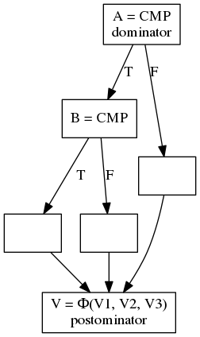
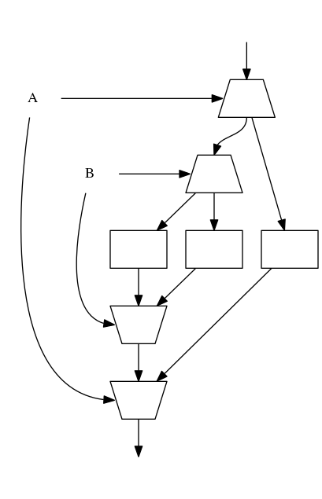

=======================
CSA Dataflow Conversion
=======================

**Intel Top Secret**

.. contents::
   :local:

.. toctree::
   :hidden:

Introduction
============

This page documents the behavior of the CSA dataflow conversion pass. This pass
does the most important job of the compiler for the CSA target: converting the
control-flow centric logic of the earlier stages of LLVM into the dataflow
representation that later passes operate on.

The primary principle of dataflow conversion is that the pass should only
generate the fundamental dataflow operators (pick operators, analogous to phi
instructions, and switch operators, analogous to branches). In addition to
these fundamental operators, logical-and/or and dynamic predication operators
will also be generated as needed to support the correct conversion of a generic
control flow graph.

Overview
========

The conversion algorithm consists of several phases:

1. Construct the control-dependence graph and control-dependence regions. These
   regions are the fundamental basis for computing when and how to generate the
   picks and switches.
2. Pre-conversion cleanup of the code:

   - Move constant initialization to the entry block, where they are replaced by
     gate instructions on the memory ordering edge. (This is necessary, since we
     don't usually have block predicate edges suitable for gating instructions
     later. A later optimization pass pushes these constants as late as
     possible).
   - Run the first phase of LIC group calculations, so as to avoid worrying
     about helper code inserted by dataflow conversion.

3. Insert switches where necessary.
4. Convert phi instructions to picks. There are two mechanisms to generate this
   logic, and they are each defined on a loop basis. At present, we only switch
   between these mechanisms on a per-function basis.

   - The first alternative is structured phi conversion. For structured control
     flow cases (involving if statements, single-exit/single-backedge loops, and
     some cases of logical and statements), the indexes of the picks can be
     computed by relatively simple means. Not all control flow graphs are
     supported by this mechanism.
   - The second alternative is dynamic predication. Dynamic predication
     propagates a 1-bit active/inactive block predicate throughout the program,
     and uses specialized instructions to compute the pick parameters. The
     specialized instructions are logically equivalent to complex chains of
     logical and/or operators that are necessary to generate the equivalent code
     for structured phi conversion, and as such, it is actually likely to be
     superior in performance to structured phi conversion for these cases, were
     structured phi conversion extended to handle them.
   - A third alternative exists, but is not implemented in the pass. Instead of
     statically computing the picks, it is possible to use pickany to execute a
     successor block when any of its predecessor blocks completes execution.
     Such an approach does have risk of correctness issues if the order is
     important, and the use of a pickany instruction also potentially introduces
     deadlock.

5. Push code to run on the dataflow execution array wherever possible. Future
   changes are expected to make the code assume that all instructions run on
   the dataflow array.
6. The second phase of LIC group discovery runs. This phase assigns the
   operators introduced by dataflow to LIC groups.
7. Control flow information (predominantly branch probability) is propagated to
   LIC group data.
8. The original basic blocks, and related control flow instructions, are removed
   from the function.

Switch generation
=================

The switch generation logic is based off of a custom liveness tracking for
registers. For each register, we track liveness by walking the predecessor paths
of every basic block with a use until we hit the definition, keeping track of
every basic block where the value is live at the start of the basic block
(excluding PHIs).

After the live basic blocks are computed, PHIs are inserted to represent values
that will need to eventually be derived from picks. The destination registers
for these PHIs are saved in an array that maps basic blocks to which switched
value is appropriate for the block. The live blocks are then traversed in
reverse postorder, filling in missing values with switches as necessary. The
actual legs of the earlier generated PHIs are filled with values from their
predecessor blocks. Finally, every use is rewritten with the appropriate
mapping.

A modification to the above algorithm is made to reduce the number of picks and
switches that are inserted. Instead of tracking based on basic blocks, the
information is tracked using control-dependent regions. Since control-dependent
regions have the same execution counts, it is safe to reuse values generated in
one basic block of a region in any other basic block of that region, without any
intervening switches or picks (although this may require increased buffering for
performance).

The use of live variable tracking means that this single algorithm can handle
all of the different cases of switch generation: whether it is tracking values
through statements, handling uses of variables outside of loops, or even the
need to repeat values in irreducible loops.

Pick generation
===============

The generation of pick instructions is the most complex part of dataflow
conversion. There are two separate ways that picks can be generated.
Structurized phi conversion tries to insert picks based on patterns of
structurized control flow graphs. Dynamic predication is a more generic fallback
mechanism that works on any graph but tends to produce code that is less
amenable to further optimization.

Structurized phi conversion
---------------------------

For structurized phi conversion to work, the graph must have a form that the
conversion can handle. There are three phases to structurized phi conversion:
handling loops, creating pick trees for non-loops, and patching pick trees.

Loop phi canonicalization
~~~~~~~~~~~~~~~~~~~~~~~~~

TO BE WRITTEN.

Creating pick trees
~~~~~~~~~~~~~~~~~~~

In the second phase, we generate picks from generic phi instructions. Ideally,
we can think of these phis as coming from the footers of if statements, but
optimizations may introduce more exotic control flow. There are two related
problems for this phase of phi conversion: building a tree of picks that
select inputs for the graph, and then computing the actual control values for
those picks.

When the CFG has the property that every phi postdominates its immediate
dominator, such as in the above graph, the resulting graph is a simple graph
that can be easily handled by dataflow conversion. The resulting pick tree is a
mirror of the switch tree that will be generated.

The implementation works by starting at a phi in a target block, and then
walking each operand of the phi back through control-dependent predecessors of
the corresponding basic block until it reaches the immediate dominator of the
phi. If a phi operand is itself another phi, it is treated as if it were a
branch on the original phi. As the parent chain is walked in the
control-dependence tree, picks are created using the control edge of that node.

In the case where the graph is not a nested set of simple regions, such as
where the phi does not postdominate its immediate dominator, or where nodes
have multiple control-dependent predecessors (ignoring loops), then the
algorithm above does not generate correct code. In the first case, the
resulting pick trees will have holes where no value can be provided. In the
second case, some operands will be repeated in the pick graph.

Patching pick trees
~~~~~~~~~~~~~~~~~~~

TO BE WRITTEN.

This logic is where most dataflow conversion bugs seem to occur, and is almost
certainly problematic at the moment.

Example
~~~~~~~

Consider the following machine IR:

.. code-block:: text

   bb.0:
     successors: %bb.1, %bb.2
     %cmp.A:ci1 = ...
     bt %cmp.A, %bb.2
     br %bb.1
   bb.1:
     successors: %bb.3, %bb.4
     %cmp.B:ci1 = ...
     bt %cmp.B, %bb.3
     br %bb.4
   bb.2:
     successors: %bb.5
     %v1:ci64 = MOV 1
     br %bb.5
   bb.3:
     successors: %bb.5
     %v2:ci64 = MOV 2
     br %bb.5
   bb.4:
     successors: %bb.6
     %v3:ci64 = MOV 3
     %x1:ci64 = MOV 1
     br %bb.6
   bb.5:
     successors: %bb.6
     %v4:ci64 = PHI %v1:ci64, %bb.2, %v2:ci64, %bb.3
     %x2:ci64 = MOV 2
     br %bb.6
   bb.6:
     %v:ci64 = PHI %v4:ci64, %bb.5, %v2:ci64, %bb.4
     %x:ci64 = PHI %x1:ci64, %bb.4, %x2:ci64, %bb.5

The pick tree for ``%v`` is built by investigating the first PHI operand, which
is a PHI operand itself, so that phi is recursively investigated. The first
operand is ``%v1``, so the partial pick tree is constructed:

.. code-block:: text

   %v:ci64 = PICK64 %cmp.A:ci1, $ign, %v1:ci64

Since we only expanded one operand so far, the partial pick tree has some
missing parameters. When the next operand, ``%v2`` is analyzed, the pick tree
continues. Since the node is control dependent on two nodes, the pick tree gains
another level:

.. code-block:: text

   %v.B:ci64 = PICK64 %cmp.B:ci1, $ign, %v2:ci64
   %v:ci64 = PICK64 %cmp.A:ci1, %v.B:ci64, %v1:ci64

The final operand fills out the pick tree:

.. code-block:: text

   %v.B:ci64 = PICK64 %cmp.B:ci1, %v3:ci64, %v2:ci64
   %v:ci64 = PICK64 %cmp.A:ci1, %v.B:ci64, %v1:ci64

Note that in our original graph, the graph was not well-structured. However,
if you look only at the computation that leads up to ``%v``, the result is
well-structured, so we have no problems generating a valid pick tree here. This
is why the algorithm treats phi operands as if they were extra operands on the
original phi node.

The ``%x`` pick tree is not so lucky. The first operand does not present any
problems:

.. code-block:: text

   %x.B:ci64 = PICK64 %cmp.B:ci1, %x1:ci64, $ign
   %x:ci64 = PICK64 %cmp.A:ci1, %x.B:ci64, $ign

When we look to the source of ``%x2``, the node has multiple control-dependent
parents. We add ``%x2`` along each of those edges:

.. code-block:: text

   %x.B:ci64 = PICK64 %cmp.B:ci1, %x1:ci64, %x2:ci64
   %x:ci64 = PICK64 %cmp.A:ci1, %x.B:ci64, %x2:ci64

The result of the pick tree would compute the correct computation, but we only
want ``%x2`` to be steered to one of the nodes in the pick tree, not both of
them. As the same value appears in a pick and its parent pick, we can replace
this scenario with a logical and instead:

.. code-block:: text

   %not.A:ci1 = NOT1 %cmp.A:ci1
   %not.B:ci1 = NOT1 %cmp.B:ci1
   %cmp.AandB:ci1 = LAND1 %not.A:ci1, %not.B:ci1, 1, 1
   %x:ci64 = PICK64 %cmp.AandB:ci1, %x2:ci64, %x1:ci64

Dynamic predication
-------------------

To be written.

Debugging
=========

Dataflow conversion is necessarily one of the most complex passes in the CSA
compilation flow, and as such, it has a propensity for generating complex bugs.
Facilities are added to make it easier to debug.

The control flow and control-dependence graphs, as well as the dominator and
postdominator trees, of a function immediately before dataflow conversion can
be dumped using ``-csa-view-machine-{cfg,cdg,dt,pdt}`` command line options.
This is the best way to view graphs, since no control-flow graph modifications
are done between this point and dataflow conversion.

Using ``-debug-only=csa-cvt-cf-df-pass`` outputs a verbose debugging output for
dataflow conversion. First, the output of the first phase of LIC grouping is
dumped, which shows in which basic blocks every variable is defined (and is
often easier to track than the full machine IR dump, since it doesn't muddy the
output with uses).

Switch generation causes a dump of every switch and every PHI added, broken
down by the register being switched. The basic blocks they correspond to are
also displayed. After switch generation, the machine IR is dumped.

The generation of picks dumps first the PHI being processed, and then the
ultimate sources of those picks from various branches. The generated pick tree
before patching is also dumped.

After pick generation is completed, the machine IR is dumped, showing the
complete IR before basic blocks are removed. LIC grouping runs again, this time
mapping every register to a LIC frequency, and printing out any registers that
have yet to had frequency assigned to them. Should the frequency information
be inconsistent (usually meaning that values failed to be picked or switched
correctly), an assertion fires at this point.
