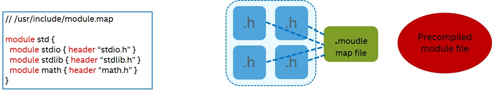

==========================================
Intel intrinsics header files compile time
==========================================

.. contents::
   :local:

Introduction
============

Intel intrinsics are C style functions that provide access to many Intel instructions without the need to write assembly code.

With the addition of avx512 intrinsics support to llvm org, the intrinsic header files got really big which impacts the compile time of sources which include the ``x86intrin.h`` file.

Current working model in llvm
=============================

User code & header files
------------------------

The user includes ``<x86intrin.h>`` (or ``<Intrin.h>`` in Windows) and uses the ``_mm*`` intrinsic interface.

:tst.c:

.. code-block:: c
  :emphasize-lines: 4,8

  #include <x86intrin.h>
 
  __m128i test(__m128i a, __m128i b) {
    return _mm_add_epi32(a, b);
  }
 
  __m64 test2(__m64 a, __m64 b) {
    return _mm_add_si64(a, b);
  }

There are two kinds of implementations in clang to these intrinsics.

1. Wrapper functions that call clang builtin functions:

:emmintrin.h:

.. code-block:: c
  :emphasize-lines: 4

  static __inline__ __m64 __DEFAULT_FN_ATTRS
  _mm_add_si64(__m64 __a, __m64 __b)
  {
    return (__m64)__builtin_ia32_paddq((__v1di)__a, (__v1di)__b);
  }

2. Implemented with C code (with vector type extensions).
This follows a general policy that the intrinsics should generate generic IR whenever possible, since this increases the llvm optimizer's ability to optimize the code.

:emmintrin.h:

.. code-block:: c
  :emphasize-lines: 4

  static __inline__ __m128i __DEFAULT_FN_ATTRS
  _mm_add_epi32(__m128i __a, __m128i __b)
  {
    return (__m128i)((__v4su)__a + (__v4su)__b);
  }

Some intrinsics (The ones that get an Immediate or Rounding mode parameters) are defined by macros: (**Q**: Why? **A**: Out of scope for this discussion. You can read more in :ref:`why_do_we_have_macro_intrinsics_label`)

.. code-block:: c
  :emphasize-lines: 2

  #define _mm_max_round_ss(A, B, R) __extension__ ({ \
    (__m128)__builtin_ia32_maxss_round_mask((__v4sf)(__m128)(A), \
                                            (__v4sf)(__m128)(B), \
                                            (__v4sf)_mm_setzero_ps(), \
                                            (__mmask8)-1, (int)(R)); })

Compiler builtins & llvm IR intrinsics
--------------------------------------

Clang supports a number of builtin library functions with the same syntax as GCC, and in addition some that GCC does not.

These builtins are defined inside Clang (``Builtins<Target>.def``) along with their types and required-feature. (They do not need to be prototyped in the intrinsic headers).

:BuiltinsX86.def:

.. code-block:: c

  TARGET_BUILTIN(__builtin_ia32_paddd, "V2iV2iV2i", "", "mmx")
  TARGET_BUILTIN(__builtin_ia32_paddq, "V1LLiV1LLiV1LLi", "", "sse2")

llvm IR supports the notion of an "intrinsic function".
The llvm target-specific intrinsics (``@llvm.x86...``) are defined in llvm ``Intrinsics<Target>.td`` and they can be defined with a clang builtin mapping. In such case, Clang will “automatically” emit the intrinsic when generating code for the builtin.

**IntrinsicsX86.td**

.. code-block:: c
  :emphasize-lines: 1,5

  def int_x86_mmx_padd_d : GCCBuiltin<"__builtin_ia32_paddd">,
              Intrinsic<[llvm_x86mmx_ty], [llvm_x86mmx_ty, llvm_x86mmx_ty],
                        [IntrNoMem]>;

  def int_x86_mmx_padd_q : GCCBuiltin<"__builtin_ia32_paddq">,
              Intrinsic<[llvm_x86mmx_ty], [llvm_x86mmx_ty, llvm_x86mmx_ty],
                        [IntrNoMem]>;

Builtins that are not mapped directly to an llvm intrinsic should be handled in Clang ``CGBuiltin.cpp``, where the appropriate llvm IR should be emitted.

:CGBuiltin.cpp:

.. code-block:: c
  :emphasize-lines: 3,6

  EmitX86BuiltinExpr(unsigned BuiltinID, const CallExpr *E) {
  // …
    switch (BuiltinID) {
    default: return nullptr;
    // …
    case X86::BI__builtin_ia32_vec_init_v2si:
      return Builder.CreateBitCast(BuildVector(Ops),
                                 llvm::Type::getX86_MMXTy(getLLVMContext()));
    // …

Back to our first example, if we examine the llvm IR emitted by Clang we see that intrinsics that are implemented with C code will result in generic llvm IR

.. code-block:: llvm
  :emphasize-lines: 3

  %0 = bitcast <2 x i64> %a to <4 x i32>
  %1 = bitcast <2 x i64> %b to <4 x i32>
  %add.i = add <4 x i32> %1, %0
  %2 = bitcast <4 x i32> %add.i to <2 x i64>

While intrinsics that are implemented with a builtin call will result with llvm target-specific intrinsics.

.. code-block:: none
  :emphasize-lines: 5

  %0 = extractelement <1 x i64> %a, i32 0
  %1 = bitcast i64 %0 to x86_mmx
  %2 = extractelement <1 x i64> %b, i32 0
  %3 = bitcast i64 %2 to x86_mmx
  %4 = tail call x86_mmx @llvm.x86.mmx.padd.q(x86_mmx %1, x86_mmx %3)
  %5 = bitcast x86_mmx %4 to i64

Problem statement
=================

With the addition of avx512 intrinsics the headers got really big.
This impacts compile time for every source file that includes ``x86intrin.h``.

**How many intrinsics are we talking about?**

* ``x86intrin.h`` pulls in about 50 header files.
* Together they declare and define more than 5000 intrinsic functions.
* More than 3700 of them are AVX512 intrinsics.
* Approximately 1200 are macro defined.
* Compile time for ``x86intrin.h`` with avx512 support is ~3X slower than without it.

The discussion in the community, for example, started because on Windows, C++ system headers like string.h end up pulling in ``x86intrin.h`` (Which means that even a small ``hello world`` could require compiling all the avx512 headers)

**Q:** Can we exclude a group of target intrinsics using ``#ifdef``?

**A:** This is already done Windows targets. However, this is just a temporary fix, since eventually we want all the intrinsics to be always available. Moreover, we would like to improve compile time also for users that actually do want all the target-features.

Solution proposals
==================

Two possible solutions to minimize compile time while keeping all intrinsics available, were brought up in the cfe-dev mailing list. One more solution was proposed internally.

Links to the discussions in the community:

* http://lists.llvm.org/pipermail/cfe-dev/2016-May/048847.html

* http://lists.llvm.org/pipermail/cfe-dev/2016-June/049513.html

1. Change the intrinsic functions to compiler builtins
-------------------------------------------------------

Make the ``_mm*`` intrinsics into compiler builtins like the ``__builtin_ia32`` functions.

:Pros:

* No user compile time (builtins don’t even require declarations)
* Eliminates the macro intrisics

:Cons:

* Less usability for the developer since the intrinsics prototypes will no longer reside in the header files.
* Intrinsics that are defined with C code (and not a builtin call) will have to be defined in Clang ``CGBuiltin.cpp`` with the IR Builder API.
* Might require a large effort (dev time) & High maintenance (Supporting via a header file is always easier).
* Requires significant changes in the intrinsics infrastructure.

2. Use Clang 'Modules' 
-----------------------

:ref:`what_are_modules_label`

Enable ‘Modules_’ exclusively for the intrinsics headers (More accurately, for a limited builtin headers subset that doesn’t touch any system headers).

:Pros:

* Save user preprocessing & parsing time starting from the 2nd compilation (~90% of the compile time for ``x86intrin.h``)
* Most header files content will not have to change (Hierarchy might though)
 
:Cons:

* Not 100% compatible with current header/include model (clean preprocessor state, macros - can’t “enter” the header, and maybe more)
* Doesn’t eliminates the macro intrinsics

2a. Use Clang 'Modules' and pre-build the modules as part of the build system
------------------------------------------------------------------------------

This can be seen as a further optimization of solution 2, in which we parse the actual module files for the builtin headers as part of the Clang/llvm build system.
	
:Pros:

* Save user preprocessing & parsing time starting from the 1st compilation. (~90% of the compile time for ``x86intrin.h``)
* Most header files content will not have to change (Hierarchy might though)
 
:Cons:

* Not 100% compatible with current header/include model (clean preprocessor state, macros - can’t “enter” the header, and maybe more)
* Doesn’t eliminates the macro intrinsics
* Need to distribute the ``.pcm`` (pre-compiled module) files (Where? will read-only locations work?)
* Need to build ``.pcm`` per *language options X target arch(triple)* (Will also require maintenance for new targets)

3. Import pre-compiled llvm bitcode
-----------------------------------

Separate the intrinsics to headers (declarations only) & implementation sources (definitions).
Pre-compile the intrinsics implementation sources to llvm IR bitcode as part of the build system.

Import the llvm IR bitcode with a pass that injects required definitions on demand (lazy)

:Pros:

* Save user preprocessing, parsing & IR generation time for the intrinsic function definitions (~60% of compile time for ``x86intrin.h``)

:Cons:

* Need to add all the infrastructure to llvm org:
    
	* builtin import pass

	* control for applying the actual imports based on the architecture.

* Need to distribute the ``.bc`` files? (not sure about this one)

* Need to build ``.bc`` per language/Target/OS/etc

* Load time of the built-in module might be expensive (Not covered in the measurements)

* Doesn’t eliminates the macro intrinsics (they will stay in the headers)

Compile time measurements for ``x86intrin.h``
=============================================

Four average compile time measurements were conducted:

* **Test Suite 1**: 1 translation unit - includes ``x86intrin.h``
* **Test Suite 2**: 5 translation units - each includes ``x86intrin.h``
* **Test Suite 3**: 1 translation unit - includes ``x86intrin.h`` and calls all the avx512f intrinsics.
* **Test Suite 4**: 7 translation units - each includes ``x86intrin.h`` and calls all the avx512{f,bw,dq,vl,vlc,cd,vldq} intrinsics.

Each test suite was compiled five times.

The measurements were conducted on a Skylake i5-6600 CPU @ 3.30GHz
with Linux x86_64 Red Hat.

The Clang version used was 3.9.0 (cfe/trunk 275158) with different sets of intrinsic header files:

* Vanilla
* No avx512
* A module map for all the header files included by ``immintrin.h`` (a subset of ``x86intrin.h``)
* Definitions removed. (Contain only declarations and macros).

The flags used were:
``-march=skx {-fmodules -fno-implicit-module-maps -fmodule-map-file=immintrin.modulemap}``

These are the average compile times: (time values in seconds)

.. csv-table::
   :header: "Method", "Test suite 1", "Test suite 2", "Test suite 3", "Test suite 4"
   :widths: 50, 20, 20, 20, 20

   Vanilla,1.81,	8.97,	5.73,	22.84
   No avx512,0.53,	2.58
   immintrin module enabled- 1st comp,2.24,	2.82,	6.3,	13.83
   immintrin module enabled- 2nd+ comp,0.16,	0.74,	4.24,	11.76
   Definitions removed,0.68,	3.32	

Recommended solution
====================

Taking into account the clang community direction, development effort & actual compile time impact the recommended solution to be implemented is - **2 Use Clang 'Modules'**.

* This solution can also be upgraded to solution **2a** in a 2nd iteration if we will find it worthwhile.

* Since it doesn't require much changes to the actual header files content, we can always fall back to the current solution if required.

.. _what_are_modules_label:

What are Modules?
=================

Modules is a feature trying to make its way into the C family standard.

The current model for using libraries in C is by using header files and the C Preprocessing model.

* User includes a header file that exposes the library API.

* Preprocessor ‘cuts & paste’ header content in each ``#include`` directive.

This model has many problems:

* Fragility – Macros conflicts & more.

* Performance – Non scalable (*M* headers with *N* sources -> *M x N* build cost)

Modules provide an alternative way to use software libraries that provides better compile-time scalability and eliminates many of the problems inherent to using the C preprocessor to access the API of a library.

A module is essentially a package describing a library (API & implementation)

:main.c:

.. code-block:: c
  :emphasize-lines: 1

  import std.stdio;

  int main() {
    printf ("hello world\n");
  }

:stdio.c:

.. code-block:: c
  :emphasize-lines: 1

  export std.stdio:

  public:
  typedef struct {
   ... } FILE;

  int printf(const char*, ...) {
    // ... 
  }
  
  int fprintf(FILE *, const char*, ...) {
    // ... 
  }
  
  int remove(const char*) {
    // ...
  }

* ``import`` makes the API of the named module available 
* ``import`` ignores preprocessor state within the source file

There are currently two experimental implementations of modules in C++: MS VS 2015 and Clang.

Clang 'Modules'
---------------

Clang takes an approach that allows a gradual transition from headers to modules.

Builds modules directly from the headers. (The ``include`` directive is automatically mapped to an ``import``)

Introduces module maps, which describe how a collection of existing headers maps on to the structure of a module.

* ``module`` defines a named (sub)module

* ``header`` includes the contents of the name header in the current (sub)module

compilation model
~~~~~~~~~~~~~~~~~

.. code-block:: c
  :emphasize-lines: 1

  #include <stdio.h>  // --> import std.stdio;

  int main() {
    printf ("hello world\n");
  }

* Find a module map for the named module

* Spawn a separate instance of the compiler:

 * Parse the headers in the module map

 * Write the module file

* Load the module file at the ``import`` declaration

* Cache module file for later re-use

More about modules at:

* Clang 3.5 Documentation: Modules. http://clang.llvm.org/docs/Modules.html

* Modules - Presentation by Douglas Gregor. http://llvm.org/devmtg/2012-11/Gregor-Modules.pdf

* Modules in C++ - Proposal by Daveed Vandevoorde: http://www.open-std.org/jtc1/sc22/wg21/docs/papers/2012/n3347.pdf

* C++ Modules in VS 2015: https://blogs.msdn.microsoft.com/vcblog/2015/12/03/c-modules-in-vs-2015-update-1/

* A Module System for C++ - Proposal by Microsoft: http://www.open-std.org/JTC1/SC22/WG21/docs/papers/2015/n4465.pdf

.. _Modules: http://clang.llvm.org/docs/Modules.html

.. _why_do_we_have_macro_intrinsics_label:

Macro defined intrinsics
========================

Some builtins expect an “immediate” integer argument. (e.g. Rounding mode parameter).
The argument must be an integer constant expression that clang can constant fold.
This means, such builtins can’t be wrapped with a function that passes a variable as done in regular intrinsic wrapper functions.
To enable the usage of such _mm* intrinsics with an integer constant expression we macro define the intrinsic to the appropriate builtin.

.. code-block:: c
  :emphasize-lines: 1,2,5

  #define _mm_max_round_ss(A, B, R) __extension__ ({ \
    (__m128)__builtin_ia32_maxss_round_mask((__v4sf)(__m128)(A), \
                                            (__v4sf)(__m128)(B), \
                                            (__v4sf)_mm_setzero_ps(), \
                                            (__mmask8)-1, (int)(R)); })

Why don't we like macro defined intrinsics?
--------------------------------------------

One reason is because they are bad for diagnostics. If a user passes wrong arguments to a macro-defined intrinsic he will get different diagnostics than when using a regular intrinsic function.

:Example:

Invalid conversion instead of incompatible type:

.. code-block:: c
  :emphasize-lines: 2,3

  void foo(int a, __m128d b){
    _mm_add_round_sd(a,b,0);  //macro-defined intrinsic
    _mm_add_sd(a,b);          //regular intrinsic
  }

.. code-block:: bash

  tst.c:7:3: error: invalid conversion between vector type '__v2df' (vector of 2 'double' values) and integer type 'int' of
        different size
    _mm_add_round_sd(a,b,0);
    ^~~~~~~~~~~~~~~~~~~~~~~
  avx512fintrin.h:1068:41: note: expanded from
        macro '_mm_add_round_sd'
    (__m128d) __builtin_ia32_addsd_round ((__v2df) __A, (__v2df) __B, \
                                          ^~~~~~~~~~~~
  tst.c:8:14: error: passing 'int' to parameter of incompatible type '__m128d' (vector of 2 'double' values)
    _mm_add_sd(a,b);
               ^
  emmintrin.h:48:20: note: passing argument to
        parameter '__a' here
  _mm_add_sd(__m128d __a, __m128d __b)
                     ^
  2 errors generated.

No diagnostics due to the explicit cast in the macro definition:
  
.. code-block:: c
  :emphasize-lines: 2,3

  void foo(__int128 a, __m128d b){
    _mm_add_round_sd(a,b,0);  //macro-defined intrinsic
    _mm_add_sd(a,b);          //regular intrinsic
  }

.. code-block:: bash

  tst.c:8:14: error: passing '__int128' to parameter of incompatible type '__m128d' (vector of 2 'double' values)
    _mm_add_sd(a,b);
               ^
  emmintrin.h:48:20: note: passing argument to
        parameter '__a' here
  _mm_add_sd(__m128d __a, __m128d __b)
                     ^
  1 error generated.

.. todo::

  TODO: Add more reasons if there are any.
  
**TODO**  Add more reasons if there are any.
