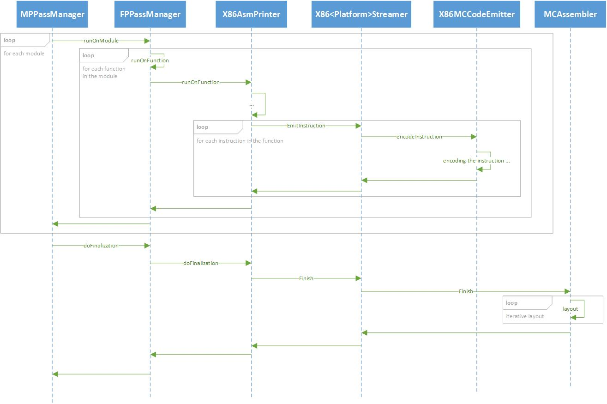
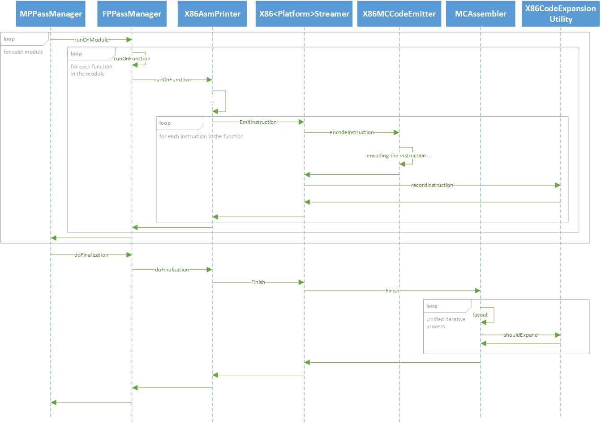

============================================================================================
Adding nop instructions to avoid processor pitfalls and improve performance: Design document
============================================================================================

.. contents::
   :local:
   
Introduction
============

In several cases when running machine instructions on Intel's CPU a slowdown can occur due to the fact
that the instructions are somewhat congested together. i.e. a (often heavy) performance penalty can be
avoided if the instructions were further apart. This can happen, for example, when several instructions
which share the same instruction address window are competing for the same resources. Making them further
apart will divide the instruction more evenly between different instruction address windows, and thus
will eliminate the penalty.

Known concrete issues
=====================

Both of the issues that will be described are caused by a hardware flaw. i.e. they will probably be
(or already have been) fixed in future CPUs with future microarchitecture. Nevertheless, they need to
be addressed and fixed. Thus, the fix will be a software fix in the compiler.

8 jmps target array buffer overflow
-----------------------------------

Commonly in Intel's microarchitectures, a front end has a target array buffer that contains up to 8 jmps
(4 short jmps and 4 long jmps, where a short jmp can also occupy a long jmp position, but not the other way
around) per each instruction address window. That means that if, for example, a specific window contains
five long jmps then the buffer will overflow. This will result in a penalty, since the fifth jmp will not
be predicted, and stalls will be inserted to the pipeline.

This problem was only recently discovered in Skylake, and that is because Skylake has (and is the first
to have) a 32 byte instruction address window. Previous CPUs had 16 byte instruction address window. This
means that the probability of such an event to happen increases, and so it was revealed when running a benchmark.
Note that this issue occurs with all types of jmps, including conditional jmps, unconditional jmps, and calls.

Observe the following C code:

.. code-block:: c

   int glob = 0;
   
   void inc()
   {
      glob++;
   }
   
   void dec()
   {
      glob -= 2;
   }
   
   int main(int argc, char* argv[])
   {
      int b = argc % 2;
      
      void (*h0)(void) = b == 0 ? inc : dec;
      void (*h1)(void) = b == 1 ? inc : dec;
      void (*h2)(void) = b == 0 ? inc : dec;
      void (*h3)(void) = b == 1 ? inc : dec;
      void (*h4)(void) = b == 0 ? inc : dec;
      void (*h5)(void) = b == 1 ? inc : dec;
      void (*h6)(void) = b == 0 ? inc : dec;
      void (*h7)(void) = b == 1 ? inc : dec;
      
      for(int i = 0 ; i < 100000 ; ++i)
      {
         h0();
         h1();
         h2();
         h3();
         h4();
         h5();
         h6();
         h7();
      }
   
      return glob;
   }

Here is a snippet from the generated code, from the area of the calls to h0 – h7:

.. code-block:: none
   :emphasize-lines: 4-10

   4006a0:	...
   .
   .
   4006aa:	41 ff d7 	callq	*%r15
   4006ad:	41 ff d6 	callq	*%r14
   4006b0:	41 ff d7 	callq	*%r15
   4006b3:	41 ff d6 	callq	*%r14
   4006b6:	41 ff d7 	callq	*%r15
   4006b9:	41 ff d6 	callq	*%r14
   4006bc:	41 ff d7 	callq	*%r15
   4006bf:	41 ff d6 	callq	*%r14
   4006c2:	89 df 	movl	%ebx, %edi

Since the function calls were forced to be indirect, they count as long jmps. We have a 32 byte instruction address window starting at 4006a0 and ending at 4006bc. Note that the call command located at 4006bf will be included in the next window since what counts is where the command ends and not where it begins (and this command ends in the next window). So, we have 7 long jmps in one instruction address window, 3 more than the buffer can hold, and the expected penalty occurs - this program runs ~1.5 times slower than if we would “push” the 3 last calls to the next instruction address window (e.g. by using nops)!

Stew update collision in the global branch predictor
----------------------------------------------------

A stew is a sort of hashed value used by the global branch predictor to predict the direction of a branch. It is a single “key” used to track branch traces. Its value is updated using an algorithm specific to the hardware when a branch is taken, and left alone when not taken. This algorithm always includes the LIP (last ip of the branch instruction), and sometimes the target of the branch. However, it does not always include the last (least significant) 4 bits of the LIP. Therefore, if two or more branch instructions share the same instruction fetch line (i.e. share the same IP up to the last 4 bits) they may yield the same stew. In that case, they will alias in the BPU, which will result in a penalty.

This issue is fixed in CNL and beyond (where all lower bits of IP address are used), but still needs to be fixed via software for earlier CPUs.

To understand this issue, let's take an example with loop back-edges:

.. code-block:: c

   for (i = 0; i < n; i++)
   {
      for (ii = 0; ii < nn; ii++)
      {
         if(/* some condition */)
         {
            /* do stuff ... */
         }
      }
   }

The generated code for this program will be:

.. code-block:: none
   :emphasize-lines: 4,8,11

   094A
   .
   095E      testl
   0961      jnz      0x993
   0963
   .
   099E      cmpq
   09A1      jnge     0x957    inner loop
   .
   09AB      cmpq
   09AE      jnge     0x94A   outer loop

Let's view the stew throughout the execution of the program. Note that in this given architecture, the jmp target address does not affect the stew.

There are two primary ways to get to the jnz instruction in 0x0961:

1. By taking the branch of the jnge instruction in 0x09A1
2. By falling through (not taking the branch of) the jnge instruction in 0x09A1 and taking the branch of the jnge instruction in 0x09AE

Now, consider an execution of the program in which the jmp instruction at 0x09A1 was reached, and the value of the stew is x (for an arbitrary x). If the branch will be taken, the stew will be updated using the IP of the branch instruction (omitting the last four bits) and will become x + 0x09A (where '+' is just a way of saying "is updated with"). On the other hand, if the branch will not be taken, the stew will not change (recall no change is made when a branch is not taken). However, if the next jmp, the jnge instruction at 0x09AE, will be taken (which is highly likely since it is the outer loop jmp), then using the same logic and algorithm the stew will again be updated to x + 0x09A.

In both cases the jnz instruction at 0x0961 will be reached with stew = x + 0x09A, and that is the stew that the BPU will use to predict this branch. The same stew is generated using two different routes, which means state information was lost, and the BPU will treat both cases the same. In other words, the history information, on which the BPU relies in its decisions, is lost. This will cause many mispredictions, and a serious performance penalty.

One extra fetch line and one extra nop will result in a 40% faster program:

.. code-block:: none
   :emphasize-lines: 9

   094A
   .
   095E      testl
   0961      jnz      0x993
   0963
   .
   099E      cmpq
   09A1      jnge     0x957    inner loop
   09A3      nop
   .
   09AC      cmpq
   09AF      jnge     0x94A   outer loop

Recall that an instruction's fetch line is the one it ends in. Thus, the extra nop pushes the last jnge instruction to the next instruction fetch line, and prevents the stew aliasing.

The iterative code layout mechanism
===================================

After the encoding, some things still may change in the code. The iterative code layout mechanism ensures that everything fits into the right place after all the initial instruction encoding is done.

Let’s take jmp as a running example. When encoding a jmp command, the relative jmp address is not yet known (for instance, when the jmp is a forward jmp, but this is not the only case). So, when encoding a jmp command, the AsmPrinter is taking a strict approach (when using high optimization levels) and assumes that the relative address will fit in one signed byte (which will be set to a place-holding zero at this point). Since it’s possible that the relative address will be too large to fit in one byte, a Fixup is registered at this point, indicating that this yet needs to be verified. The iterative code layout mechanism, which runs after the encoding is completed and thus can view all the encoding, is the one responsible for checking that the jmp address fits in one byte, and fixing it (expanding it to four bytes) if necessary.

jmp address is one kind of Fixup. There are other kinds, and this mechanism is also responsible for handling them.

.. _iterative_code_layout_mechanism_label:

Why is it iterative?
--------------------

We’ll continue with our running example.

Consider the following output of the encoding phase:

.. code-block:: none

   0000:	jmp	00	<-- Fixup #1: jmp to "xorl	%eax, %eax"
   .
   .
   0010:	je	00	<-- Fixup #2: jmp to "movl	$2, %ecx"
   .
   .
   007E:	xorl	%eax, %eax
   .
   .
   00C8:	movl	$2, %ecx

Note that the instructions’ addresses are not yet determined at this point. For each instruction, the address written to its left is only there to illustrate the address that the instruction would have had if it weren’t for the iterative code layout mechanism.

At this point in time the iterative code layout mechanism kicks in.

Two quick reminders before the analysis continues.

1. jmp target addresses are calculated relatively to the **end** address of the instruction. The target address of the first jmp in our running example, for example, will be calculated from 0x0002.
2. When expanding a jmp address from one byte to four bytes, the opcode of the jmp changes. More specifically, the opcode size of short jmps is 1 byte, and the opcode size of long jmps is 2 bytes.

Back to the iterative code layout mechanism. This mechanism looks one by one at all the Fixups that were created during the encoding phase and handles them. At first it looks on Fixup #1. Since the relative jmp address (0x7E – 0x02 = 0x7C) can fit in one signed byte, no expansion is required and the correct address is set. Next, it looks at Fixup #2. Since the relative jmp address (0xC8 – 0x12 = 0xB6) cannot fit in one signed byte, an expansion is required. After one iteration, the product of the process will look like this:

.. code-block:: none
   :emphasize-lines: 1, 4, 7, 10

   0000:	jmp	7C	<-- Fixup #1: jmp to "xorl	%eax, %eax"
   .
   .
   0010:	je	00 00 00 B6	<-- Fixup #2.
   .
   .
   0082:	xorl	%eax, %eax
   .
   .
   00CC:	movl	$2, %ecx

Note the changes: not only have the relative addresses of the jmp instructions been set, but the speculative addresses of all the instructions that follow the second jmp instruction have increased by 4. That is because the second jmp instruction’s relative jmp address has expanded from 1 byte to 4 bytes, and now takes up 4 more bytes (= 1 extra byte for the new opcode + 3 extra bytes for the target address). However, the process is not complete. Not only that the relative jmp address of the first jmp instruction is now wrong, but it will also no longer fit in one signed byte (since it is now needs to be 0x82 – 0x02 = 0x80). If this process would not have 
been iterative, we would have ended up with wrong code.

After several more iterations we’ll get the final output:

.. code-block:: none

   0000:	jmp	00 00 00 80
   .
   .
   0014:	je	00 00 00 B6
   .
   .
   0086:	xorl	%eax, %eax
   .
   .
   00D0:	movl	$2, %ecx

Observe all the modifications, and how the final addresses have changed compared to the initial addresses.

Note that this iterative process is guaranteed to stop, since the code size is expanding monotonically.

Proposed solutions
==================

The general idea
----------------

As we’ve seen, both of the issues revolve around too many jmp instructions crowded together in some sort of an instruction window. So, the basic idea is to spread them further apart, which will eliminate these situations.

The most basic approach is to simply add nops. We’ve seen an example for the first issue in which the unmodified version takes about 1.5 time to run than the nop-added version, and an example for the second issue in which one nop makes the program run ~40% faster. This is the approach we will take to solve the problem. More complex approaches, such as rearranging existing instructions such that both correctness is ensured and the problematic instructions are kept apart from one another, will not be discussed.

The big decision in question is – when should the nop adding process occur? Recall the iterative code layout mechanism. Should the nops be added after its processing is done or should it somehow be embedded within it?

During final layout of the code
-------------------------------

Overview
++++++++

Recall that while encoding some things are yet unknown, such as the target address of jmps and their sizes (more specifically, how many bytes will it take to encode them). In order to produce complete code the encoding phase yields Fixups – locations in the code that still need to be reviewed and completed. The iterative code layout mechanism goes through those Fixups and handles them.

The basic idea of this proposed solution is to embed the nop-padding into that process. A new kind of Fixup will be created which will have the semantics of “Add n nops here” (We cannot simply add the nops at the encoding phase since the final layout is not yet known, and thus we cannot know where exactly are those nops needed). The code will be examined while encoding, and the necessity of such a Fixup will be determined using a callback function call, which can be implemented by those who need to. Two good examples for implementation are the two issues described earlier.

Pros
++++

* No need to add extra processes. We are using the existing processing of the iterative code layout mechanism.
* All matters regarding the code final layout will (still) be performed in a single place.

Cons
++++

* During the encoding phase it will be very hard to determine if nops should be inserted at any point in the code, since the nops necessity is determined according to the layout, which is only available after the process is completed.

  This will force the solution to be a heuristic one instead of an accurate one. This of course means that the code size may not be optimal, i.e. bigger than it has to be.

* Using the iterative code layout mechanism for other purpose than it was originally designed to.

  Fixups are a mechanism designed for adjusting final locations in the code, not adding instructions. There are different mechanisms for adding nops. For example, there is a mechanism that inserts nops in order to ensure that a jmp command of a loop always jmps to an aligned location.

.. _after_final_layout_of_the_code_label:

After final layout of the code
------------------------------

.. _after_final_layout_of_the_code_overview_label:

Overview
++++++++

The general idea here is to create a mechanism that is similar to the existing iterative code layout mechanism, but is separate from it.

The new mechanism will have two parts:

1. Recording "suspicious" instructions (i.e. instructions that may cause the problematic cases) throughout the encoding phase. This recording will not change anything, it is just a way to "remember" those instructions for later uses.
2. Checking if any problematic cases occured using the previously marked instructions. This will be done after the encoding phase, as part of the new :ref:`unified_iterative_process_label`. This process will examine the code in chunks of the required instruction window size (16B/32B), and will insert nops if any are needed.

.. _unified_iterative_process_label:

Unified iterative process
~~~~~~~~~~~~~~~~~~~~~~~~~

Note that the process of adding nops may change things that were already determined in the code layout phase. Thus, if we take a naïve approach, some things may go wrong, and not only the obvious address adjusting due to the addition of new instructions.

Recall the example discussed in the the iterative code layout mechanism section (see :ref:`iterative_code_layout_mechanism_label`). In that example there's an illustration of how jmp target addresses can expand at each iteration. In a very similar manner, an added nop can cause a jmp address to extend beyond the limits of one signed byte. This essentially means that after adding all the nops the iterative code layout mechanism needs to be activated again, in order to properly fix all such issues. And that’s not the end of it, since activating it may create a new need for nops. Thus, the entire process of code-layout-adding-nops must be placed under a loop and become one unified iterative process.

Note that this unified iterative process is guaranteed to stop: We've already seen that the iterative code layout mechanism is converging and is guaranteed to stop. Using similar arguments we can show that the new mechanism is guaranteed to stop: it too is expanding monotonically, as it is adding nops at each iteration. In addition, it will of course stop adding nops once the problematic instructions are sufficiently far from one another.

Pros
++++

* No need to touch the existing, somewhat delicate iterative code layout mechanism.
* Code layout is completely known at the time the new mechanism starts, which makes the analysis much easier.

.. _after_final_layout_of_the_code_cons_label:

Cons
++++

* The outputted code may not be optimal in sense of code size and number of instructions.

  To understand this, consider the following scenario: a nop is added and that causes a jmp address to be expanded. The expansion of the jmp target address from 1 byte to 4 bytes changes the alignment of the code that comes after the jumps by adding 3 bytes to all the addresses. This may result in a situation in which the original nop is no longer needed, since the expanding is done using the 3 extra bytes of the jmp. Since no further computation will be made, and there is no "mechanism for removing redundant nops", the nop will remain as part of the output.

Selected solution
=================

All things considered, the :ref:`after_final_layout_of_the_code_label` strategy is the one to be implemented. Two main reasons for that:

1. The iterative code layout mechanism isn’t exactly made for things like nop adding. I argue that the nop adding is a different process in its nature that should be done separately.
2. Accurately determining where to insert nops before the code layout is complete could prove to be an extremely hard task.

Design outline
--------------

Here's a sketch of how the processes of encoding and final code layout look like:

The idea is to add a new class (that implements a more generic interface) that will be incharge of the two phases described in the solution's :ref:`after_final_layout_of_the_code_overview_label`. It will record the instructions in the encoding phase, and will be used later to determine whether the code needs nop instructions insertion.

The same sketch will look like this:

Future work
===========

As discussed in the second (recommended) proposed solution's :ref:`after_final_layout_of_the_code_cons_label`, it has a disadvantage – it will not necessarily produce the optimal code.

In the future, after implementing a base level of the solution, some measures should be considered in order to ensure a code size more close to the optimal one. This can be done, for example, by marking the nops we added, and later on checking if they are indeed required, before completing the layout. Note that this is a delicate procedure, as adding such a mechanism means that the process of nops adding will not be monotonically expanding anymore, and thus may not converge.
