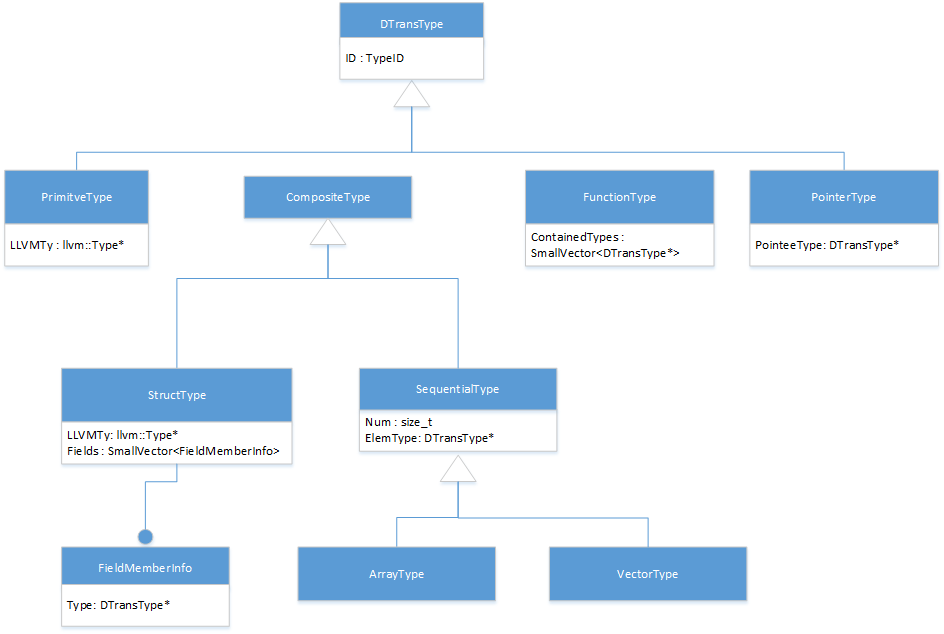
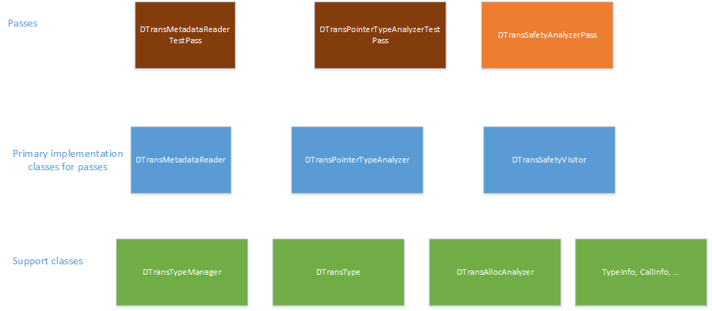

===========================================================
DTrans Infrastructure and Type Recovery for Opaque Pointers
===========================================================

.. contents::
   :local:

.. toctree::
   :hidden:

Overview
========
This document describes the DTrans infrastructure classes and handling of
pointer type recovery needed for DTrans safety analysis to be used when
opaque pointers are used by the IR.

High Level Design
=================

Requirements
------------
The main requirements for DTrans to operate are the following:

* Every [structure, array, function] pointer used needs to have information
  about what type(s) the pointer will be used as.
* Every pointer that resolves to a field member of a structure type needs to
  be identified, and load/store operations of that pointer identified.

  * This also needs to allow for a pointer value to possibly refer to
    multiple field members of the same structure. This can happen as the
    result of a select instruction or PHI node that referred to the addresses
    of different fields initially.

* Non-pointer types that hold the value of a pointer need to be identified for
  the type of pointer referred to.

In the pre-opaque pointer llvm::Type system, the types of pointers were encoded
directly in the IR. This representation allowed a direct examination of data
structures to see the relationship between structure members when a field
points to another structure type.

For example:

.. code-block:: llvm

   %struct.foo = { i32, i64*, %struct.bar*, %struct.foo* }

In the opaque pointer representation, all pointer types are a generic type.
When this is enabled, all PointerType objects in the IR simply indicate the
address space the pointer belongs to. For our purposes of DTrans with
Intel64/x86 code generation, all pointers belong to address space zero.
No information is provided about the original type of object the pointer
refers to. This will lose the ability to explicitly see the relationship
from one structure to another. In this case, %struct.foo would be represented
as:

.. code-block:: llvm

  %struct.foo = { i32, p0, p0, p0 }

This presents a problem for the DTrans analysis and transformations when
analyzing an instruction to determine the Value object type, such as:

.. code-block:: llvm

  %fa = getelementptr %struct.foo, p0 %ptr, i64 0, i32 3

In this case, it would not be known whether the 3rd field is a pointer to an
integer, a pointer to another structure, or a pointer to another pointer
without first performing type recovery of the structure members.

In order for DTrans analysis to process with safety analysis, a utility class
first needs to run, which is similar to the current LocalPointerAnalyzer, which
will analyze the IR to identify the type of objects a pointer value can refer
to. This also requires a means to represent the 'pointed-to' for the pointers
which will no longer be possible with the llvm::Type classes.

However, this also requires a means to represent the 'pointed-to' for the
pointers which will no longer be possible with the llvm::Type classes.
Because structures, arrays, functions, etc may all refer to pointer types
a new type system representation is required for use by the DTrans analysis
and transformations. This type system will consist of the following
type hierarchy, which closely mirrors the llvm::Type hierarchy in order to
provide similar interfaces.

DTrans Type Representation
--------------------------

Major component classes
-----------------------

<This it a preliminary description of design, and is subject to change>

Starting from the bottom of the diagram:

* The DTransTypeManager will handle the creation and type pooling of DTransType
   objects. (See "`Metadata encoding from the compiler front-end`_")
* The DTransType will be a base class for the DTrans type system.
* The DTransAllocAnalyzer is the existing class that analyzes functions that
  allocate/release memory. This will need to be modified to handle opaque
  pointers.
* The TypeInfo, CallInfo classes are existing support classes within DTrans,
  but will need to be modified to handle opaque pointers.

Above these are the primary classes required for safety analysis:

* TypeMetadataReader class handles decoding front-end produced metadata
  describing types.
* DTransPointerTypeAnalyzer class handles type recovery to identify what types
  the Value objects gets used as.
* DTransSafetyVisitor class analyzes the IR with the recovered types to set
  the DTrans safety checks.

Finally, these passes will be used for testing and implementing DTrans safety
analysis:

* TypeMetadataReaderTestPass is for testing the TypeMetadataReader class
* DTransPointerTypeAnalyzerTestPass is for testing the type recovery class
* DTransSafetyAnalyzerPass is the analysis pass to be used in the compiler that
  performs the metadata reading, type recovery, and safety checks.

Metadata encoding from the compiler front-end
=============================================
The LLVM IR will contain a limited number of instructions that contain the type,
which complicates the task of performing type recovery in a compile time
efficient way. For example, a pointer-to-pointer-to-pointer structure field may
be used in one function without being dereferenced to the degree that it
identifies the type within that function, which would require finding a
location where it is fully dereferenced to identify its type.

To help the compiler with this, the compiler front-end will provide some
information to help start the type recovery analysis to avoid the problems of
cross-function analysis to determine types, or the need to perform an iterative
approach to recovering types.

The main items that need to have metadata attached to them are:

* Descriptions of data structures
* Types of global variables that involve pointer types
* Types produced by 'alloca' instructions that involve pointer types
* Function signatures for definitions that involve pointer types
* Indirect function calls to describe the function signature of the call

Descriptions of data structures
-------------------------------
In order for DTrans to have accurate information for all the data structures,
a named metadata field "dtrans_types" will contain a list of metadata nodes that
describe the field member types for each structure. The named metadata field
from multiple source files get concatenated together by the IRMover when
constructing the module for LTO.

Note: in the following descriptions, the metadata id values used in one
example may refer to the metadata shown in another example.

First class types
~~~~~~~~~~~~~~~~~
First class types are primitive types in LLVM, which do not contain pointers to
other types. For example: i32 or float

Encoding:
^^^^^^^^^
.. code-block:: llvm

 !{<type> zeroinitializer, i32 <pointer level> }

Examples:
^^^^^^^^^
.. code-block:: llvm

  ; double
  !0 = !{double 0.000000e+00, i32 0 }

  ; i32
  !1 = !{i32 0, i32 0}

  ; i64**
  !2 = !{i64 0, i32 2}

Void type
~~~~~~~~~
The void type may be needed to represent a function signature type.

Encoding:
^^^^^^^^^
.. code-block:: llvm

  !{!"void", i32 <pointer level> }

Examples:
^^^^^^^^^
.. code-block:: llvm

  ; void
  !3 = !{!"void", i32 0}

  ;void**
  !4 = !{!"void", i32 2}

Array types
~~~~~~~~~~~
An array type needs to represent the number of elements and the type of element.

Encoding:
^^^^^^^^^
.. code-block:: llvm

  !{!"A", i32 <numElem>, !MDNode }

Examples:
^^^^^^^^^
.. code-block:: llvm

  ; [ 20 x i64** ]
  !5 = !{!"A", i32 20, !2}

  ; [ 8 x [ 20 x i64** ]]
  !6 = !{!"A", i32 8, !5}

Vector types
~~~~~~~~~~~~
A vector type needs to represent the number of elements and the type of element.

The vector type is the same as the array type, except using "V" for the type
identifier.

Encoding:
^^^^^^^^^
.. code-block:: llvm

  !{!"V", i32 <numElem>, !MDNode }

Function types
~~~~~~~~~~~~~~
Function types need to represent the return type, parameters types, and whether
the function can take a variable number of arguments.

Encoding:
^^^^^^^^^
.. code-block:: llvm

  !{!"F", i1 <isVarArg>, i32 <numParam>, !MDNoderet, !MDNodeparam1, !MDNodeparam2, ... }

Examples:
^^^^^^^^^
.. code-block:: llvm

   ; void (i32)
   !7 = !{!"F", i1 false, i32 1, !3, !1}

   ; i32 (...)
   !8 = !{!"F", i1 true, i32 0, !1}

Structure types
~~~~~~~~~~~~~~~
Structure types are needed to describe the fields contained with the structure.
Each metadata entry for a named structure type must be listed in the named
metadata node.
TBD: Is it necessary to indicate whether the structure is packed?

Structure types can take a variety of forms depending on the structure
definition.

Encoding:
^^^^^^^^^
.. code-block:: llvm

  Named opaque struct type: !{!"S", <type> zeroinitializer, i32 -1 }
  Named struct type: !{!"S", <type> zeroinitializer, i32 <numElem>, !MDNodefield1, !MDNodefield2, ... }
  Literal struct type: !{!"L", i32 <numElem>, !MDNodefield1, !MDNodefield2, ...}

Examples:
^^^^^^^^^
.. code-block:: llvm

  ; %struct.foo = type opaque
  !9 = !{!"S", %struct.foo zeroinitializer, i32 -1 }

  ; An empty structure
  ; %struct.empty = {}
  !10 = {!"S", %struct.empty zeroinitializer, i32 0 }

  ; %struct.bar = type { i32 (...)**, i32, i64** }
  !11 = {!"S", %struct.bar zeroinitializer, i32 3, !17, !1, !2 }

  ; %struct.bar2 = type { %struct.bar, i32, { i32, i64**} }
  !12 = {!"S", %struct.bar2 zeroinitializer, i32 3, !16, !1, !13 }

  ; A literal structure
  ; { i32, i64** }
  !13 = !{!"L", i32 2, !1, !2 }

References to encoded types
~~~~~~~~~~~~~~~~~~~~~~~~~~~
As seen above, a type often needs to refer the metadata encoding for another
type. This present challenges for structure types, because it is possible to
have circular references where a pointer to the type refers back to the original
type. While it is possible to represent this in the metadata, doing so can
result in redundant metadata when the Modules from separate byte-code files are
merged together by the IRMover due to the way metadata pool works. For this
reason, there are different encodings used depending on whether the reference is
to a pointer to a structure type or a pointer to another non-first-class type.

Encoding:
^^^^^^^^^
.. code-block:: llvm

  Reference to struct type: !{!"R", <type> zeroinitializer, i32 <pointer level> }
  Pointer to (non-struct) complex type: !{!MDNode, i32 <pointer level> }

Examples:
^^^^^^^^^
.. code-block:: llvm

  ; %struct.bar*
  !14 = {!"R", %struct.bar zeroinitializer, i32 1 }

  ; %struct.foo*
  !15 = {!"R", %struct.foo zeroinitializer, i32 1 }

  ; %struct.bar
  !16 = {!"R", %struct.bar zeroinitializer, i32 0 }

  ; i32 (...)**
  !17 = {!8, i32 2}

Metadata attached to IR
-----------------------
For metadata attached to the IR to describe global variables, alloca inst, or
function signatures; these can be tagged with a metadata type 'dtrans_type' with
a metadata of the "References to encoded types" type.

Type Recovery Process
=====================
TBD

