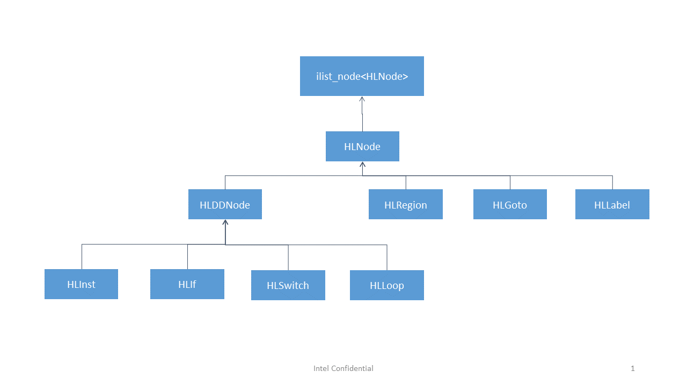

===========================
HIR DDRefs and Friends
===========================

.. contents::
   :local:

.. :Author: Dorit Nuzman
.. :        Based on notes from Pankaj.
.. :Date: 2016-01

.. Reflects current understanding/impression/guesses. To be corrected and extended.

Background
==========
HIR is a 3-address form high-level IR based on lexical order,
in comparison to LLVM IR which is CFG based.
Data dependence framework in HIR replaces def-use chains of LLVM IR.
The rational behind HIR:

- It is more intuitive to analyze loopnests in lexical order
- Loop transformations can be developed and debugged with ease

Overview
========
This document covers the main HIR constructs: HLNodes, DDRefs, CanonExprs, Blobs, and Symbases.
At a high-level:

* **HLNode**:  Nodes representing HIR constructs- regions, loops, ifs,  switches, labels, gotos and instructions
* **DDRef**:  Data dependency node of HIR embedded in HLNodes; act as source/sink of DD-edges.  All the data elements/values are represented as DDRefs, including memory references and scalars/temps.
* **CanonExpr**:  Canonical expression, or closed form representation contained in DDRefs
* **Blob**:  Arbitrary expression tree embedded inside CanonExpr. Blobs are mapped to unique indices which represent blobs inside the CanonExpr
* **Symbase**: DDRefs are associated with a Symbase. A Symbase is a unique number representing an alias-set; it corresponds to a Strongly-Connected-Component (SCC) of values. Each occurrence of a RegDDRef in a sequence of HL instructions is a separate object/instance, where several instances may be associated with the same Symbase:

**Example: DDRefs and Symbases**:

.. code:: python

            + DO i1 = 0, 3, 1
  HLInst1   |   %x.018 = %x.018  +  %1;
  HLInst2   |   %2 = (%b)[i1 + 1];
  HLInst3   |   %add4 = %x.018  +  %2;
  HLInst4   |   (%b)[i1] = %add4;
  HLInst5   |   %1 = %2;
            + END LOOP

  HLInst1   <--> DR1(%x.018), DR2(%x.018), DR3(%1)
  HLInst2   <--> DR4(%2), DR5((%b)[i1 + 1])
  HLInst3   <--> DR6(%add4), DR7(%x.018), DR8(%2)
  HLInst4   <--> DR9((%b)[i1]), DR10(%add4)
  HLInst5   <--> DR11(%1), DR12(%2)

  Symbase 3 <--> DR1(%x.018) DR2(%x.018) DR7(%x.018)
  Symbase 5 <--> DR3(%1) DR11(%1)
  Symbase 8 <--> DR4(%2) DR8(%2) DR12(%2)
  Symbase 9 <--> %b %b
  Symbase 10 <--> DR6(%add4) DR10(%add4)
  Symbase 12 <--> DR5((%b)[i1 + 1]) DR9((%b)[i1])

HIR Hierarchy
===============

HLNode Classes:

  * HLNode:  Base class for all HLNode types; represents a link list node for LLVM’s iplist data structure
  * HLRegion:  Top level node of HIR; represents a loopnest extracted out of incoming LLVM IR
  * HLGoto:  HIR construct for an unconditional branch in LLVM IR
  * HLLabel:  Target of HLGotos
  * HLDDNode:  Base class for all HLNode types which contain DDRefs
  * HLInst:  Wrapper over LLVM instructions
  * HLIf:  HIR construct for a conditional branch in LLVM IR
  * HLSwitch:  HIR construct for LLVM switch instruction
  * HLLoop:  High level loop construct; built on top of LLVM loop

DDRef Classes:

  * DDRef:  Data dependency node containing a symbase (unique number representing an alias set)
  * RegDDRef:  Operands of HLNodes; correspond to LLVM instruction operands
  * BlobDDRef:  Attached to RegDDRefs; expose data dependencies present due to temp blobs contained in RegDDRef’s CanonExprs

DefUse
======
All data in the program (all DDRefs) are nodes in a Data-Dependence Graph (DDG). The edges of the DDG can be used to obtain reaching def/use information. This holds for both the memory references and scalar references. Each node in the DDG (a DDRef) has incoming/outgoing edges which can be iterated to explore defs/uses:

.. code:: python

  scan_DDG_edges(RegDDRef *Ref){
    for (auto II = DDG.outgoing_edges_begin(Ref),
              EE = DDG.outgoing_edges_end(Ref);
         II != EE; ++II) {
      DDRef *DDref = II->getSink();
      HLDDNode *DDNode = DDref->getHLDDNode();
      HLNode *HNode = dyn_cast<HLNode>(DDNode);
      const DDEdge *edge = &(*II);
      ...
    }
  }

CanonExpr (CE)
==============
The CE representation:
  Represents a closed form as a linear equation in terms of
  induction variables and blobs. It is essentially an array of coefficients
  of induction variables and blobs. A blob is usually a non-inductive,
  loop invariant variable but is allowed to vary under some cases where a
  more generic representation is required. Blob exprs are represented using
  SCEVs and mapped to blob indexes.

  (C1 * B1 * i1 + C2 * B2 * i2 + ... + BC1 * b1 + BC2 * b2 + ... + C0) / D

  Where:
   - i1, i2 etc are induction variables of loop at level 1, 2 etc.
   - C1, C2 etc are constant coefficients of i1, i2 etc.
   - B1, B2 etc are blob coefficients of i1, i2 etc. A zero blob coefficient
     implies a constant only coefficient.
   - b1, b2 etc are blobs.
   - BC1, BC2 etc are constant coefficients of b1, b2 etc.
   - C0 is the constant additive.
   - D is the denominator.

Blob
  Represents an expression tree in the CE. Temp blobs are the most basic kind of
  blob, which represent a single value such as an LLVM instruction or global
  value.

  HIR uses SCEVs as blobs.  SCEVAddRec type is not allowed in blobs, they are either translated into CanonExpr IVs or reverse engineered into SCEVUnknowns; SCEVUnknown blobs are formed out of non-SCEVable types such as FP or Metadata types.

  In the code snippet below, the blob *%1* is defined in line <18> by an expression
  that consists of the temp blob *b*).

**Example: Blobs:**

.. code:: python

  <62> + DO i1 = 0, 3, 1 ...................Level 1
  <63> | + DO i2 = 0, 199, 1 ...............Level 2
  <18> | |   %1 = (@b)[0][i1 + %i][i2][0];
  <22> | |   %4 = trunc(2 * i2);
  <64> | | + DO i3 = 0, 49, 1 ..............Level 3
  <33> | | |   (@c)[0][i1 + %i + 1][2 * i2 + 5][2 * sext((3 * %1)) * i3 + 6] = 1;
  <36> | | |   (@c)[0][i1 + %i + 1][(%1 * %4) + 4][6 * i3] = 3;
  <64> | | + END LOOP
  <63> |  + END LOOP
  <62> + END LOOP

Induction Variables(IVs) and Nesting Levels
  The nesting levels are numbered from outermost (=1) to innermost (=highest, represents
  the deepest nesting level).
  Each nesting level is associated with a single induction variable (IV).
  Each IV is multiplied by a constant coefficient and possibly also by a Blob coefficient.
  These coefficients can be obtained per IV/level.

hasIV(Level)
  Indicates whether this CE has an induction variable at nesting level 'Level'.

  **Note!**: When hasIV(Level) returns false it does not mean that this CE is invariant at Level,
  as CE may also contain Blobs which may be defined at Level or deeper.
  Furthermore, these Blobs themselves may be computed by an expression that in itself
  depends on IVs... In other words, !hasIV(Level) does not guarantee that the IV associated
  with Level does not affect this access, as the IV may be hiding behind a Blob.

  For example, the CE {(%1 * %4) + 4} in line <36> in the code snippet above will return false
  for hasIV(level) at any level, whereas the blobs %4 and %1 are computed as a function of i2 (the IV
  of loop level 2).

DefinedAtLevel
  The nesting level where this CE is defined.
  This is the maximum (deepest) level where any tempBLob
  contained in this CE is defined.
  Constants are defined at level 0.

Linearity
  The IsLinearAtLevel() CE member checks if this CE is defined at a lower (outer) nesting level
  than where this CE is used. This means that the maximum (deepest) level where any tempBlob
  contained in this CE is defined is less than the level where this CE is used.

InvariantAtLevel(L)
  For a CE to be invariant at level L two things should hold:
  (1) !hasIV(L), and (2) DefinedAtLevel<L. In other words, the CE is not defined by the IV of level L,
  and any blob that defines it is defined at an outer (lower) nesting level than L.

Src/Dest Type
  Used to hide the topmost cast of the SCEV tree inside the CanonExpr; helps form more linear CanonExprs

Creating a new CE based on another set of CEs
  Setting a type to the new CE
    Use both the source and destination type of the CEs to create the newCE using createExtCanonExpr().
    Now, a possible issue here is that the source type of the different CEs may be different making the merging invalid.
    This can be checked using CanonExprUtils::mergeable() property (may need to bail out if it returns false, depending on the scenario).

  Setting a DefinedAtLevel to the new CE
    Ideally, we should correctly set the "defined at level" for the newCE we are creating.
    As explained above, the “defined at level” of a CE is the max level at which a blob present in the CE is defined.
    If the blob is defined at the same level at which the CE is present, it becomes non-linear.

    This can be done as follows:
    If we have added a blob to the newCE, collect all the temp blobs in the blob (collectTempBlobs() in CanonExprUtils),
    find their levels in the attached blob DDRefs (findBlobLevel() member function) and get the max level;
    If this max level is greater than the current level of newCE, update its level.

    Alternatively, use the recently added findMaxBlobLevel() member function; Note: all this is assuming we have the RegDDRef
    for these CEs (See example in getStrideAtLevel(L) RegDDRef member).

RegDDRef
========

.. code:: python

 for i1........level 1
   for i2......level 2
     for i3....level 3
         base[dim3][dim2][dim1]

A RegDDRef consists of a base and indexes:

Base:
  Refers to a Symbase.
  *TODO*.

Indexes: the CanonExprs member
   - The dimensions are numbered from lowest (1) to highest.
   - A DDRef has at least one dimension.
   - Each subscript (index to a dimension) is represented by a CanonExpr (CE).
   - **CanonExprs** is a vector/iterator of the CE's (indexes) of the dimensions of the RegDDRef.
   - In a multi-dimensional memref the size of each dimension in number of bytes, aka stride, is obtained using the members getDimensionStride()/getDimensionConstStride().
   - Example: For the LLVMIR reference (GEP A, 0, i), referring to source code array 'int A[10]' the respective HIR RegDDRef is A[0][i], such that:

     - **CanonExprs** is [i, 0]
     - Strides is [4, 40].

BloBDDRefs
  Blob DDRefs represent the temp blobs present in all the CEs in the RegDDRef. They are added to expose data dependencies which result from the blob appearing in the closed form expression (CE).

Evolution of a DDRef in a loop: getStrideAtLevel(L)
  The Coefficients of the induction variable (IV) associated with a
  specific loop nesting level determine how the memref advances in that nesting level.
  Care should be taken to check if the subscripts of the memref consist of any blobs that are not invariant at level L
  (in which case we bail out).

  Since the IV of level L can occur in multiple subscripts, the contribution of the coefficients
  from each subscript (times the respective dimension size, aka the stride) need to be
  accumulated to obtain the overall advancement (evolution) of the memref in the loop.
  This is computed by the newly added getStrideAtlevel member.

  For example: For a source level
  array ‘int A[10][10]’ and an HIR reference A[0][2*i][b*i], getStrideAtLevel will return the
  CanonExpr- 4*b + 80 (assuming that b is invariant at the level where A is used. Otherwise
  no stride will be returned).

Example
  In the below: BaseCE is b, and the CanonExprs representing the indexes into each dimension are:

    dim2: [6 * %1 * i3]:
       this CE is defined at level 2 (because of the blob %1)
    dim1: [i2 + 5]:
       this CE contains no blobs. Defined at level 0;

.. code:: python

  for i1........level 1
    for i2......level 2
      %1 = ...
      for i3....level 3
        b[6 * %1 * i3][i2 + 5]

More Questions
==============

1. How is HIR lowered to llvm-IR?

2. What is  a selfBlob?

3. Identifying Indexed Memrefs:
   Can we follow use-def information in order to track where a variable used in a DR
   (as a base pointer, or blob in a subscript)
   is coming from , e.g. in order to be able to determine
   if that DR is an indexed memref access?

   For example, in the code below,
   in order to identify that the DR '(%a)[%1 + 1]' is indexed
   we need to track how blob %1 (in the subscript of the DR)
   is defined (reaching the index array '(@b)[0][i2]').

   In the next example we need to follow the blob %0 (in the base of the DR)
   in order to identify that the DR '(%0)[0]' is indexed (the index array is '(%vec.b.cast)[i1]').

**Example: Indexed DR (subscript)**:

.. code:: python

  <36>         + DO i1 = 0, 3, 1   <DO_LOOP>
  <37>         |   + DO i2 = 0, 199, 1   <DO_LOOP>
  <12>         |   |   %0 = (@b)[0][i2];
  <15>         |   |   (%a)[%0] = 0.000000e+00;
  <18>         |   |   %1 = (@b)[0][i2];
  <22>         |   |   (%a)[%1 + 1] = 1.000000e+00;
  <37>         |   + END LOOP
  <36>         + END LOOP

**Example: Indexed DR (base)**:

.. code:: python

  <25>         + DO i1 = 0, 3, 1   <DO_LOOP>
  <9>          |   %0 = (%vec.b.cast)[i1];
  <10>         |   %1 = (%0)[0];
  <12>         |   %2 = (%vec.b.cast)[i1];
  <14>         |   %3 = (%2)[1];
  <17>         |   (%ret.cast)[i1] = %1 + %3;
  <25>         + END LOOP

