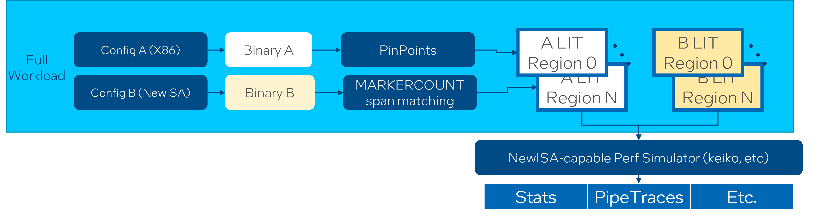

=========================
MarkerCount Specification
=========================

.. contents::
   :local:

Introduction
============

MarkerCount is a new form of forward-progress tracking that is equatable
(portable and comparable) across binaries, so that forward progress can be
compared even in the face of doing comparisons across binaries that have
been compiled differently (different optimizations, different ISAs, etc.).

MarkerCount is architecturally established and counted via special 1-byte
instructions inserted into the code stream by compiler(s).  Special 1-byte
instructions were specifically chosen to minimize overhead to the greatest
extent possible. This instrumentation is automatically inserted at periodic
points throughout a compiled workload at "idempotent" locations in order to get
equatable MarkerCount updates. The insertion is placed at function prolog,
function epilog and loop header.

High-level process
==================

1. Compile benchmarks in two ways (x86 vs. New ISA)
2. Generate matched traces that represent significat portions of the workload
3. Simulate the traces and compare IPC and uArch bottlenecks
4. Refine new ISA definitions as well as compiler support to improve performance
   , and repeat

When to emit MarkerCount
========================

MarkerCount has inevitable impact on optimizations sometimes b/c it has side
effect, so we'd like to insert it as late as possible. The compiler provides two
insertion time points: me (mid-end) and be (back-end). For mid-end, MarkerCount
is emitted before any inline or loop opt pass b/c we may have different
decisions base on ISA set and optimization level. For back-end, MarkerCount is
inserted before the first pass that destorys natural loop form.

Compiler flags
==============

``Global control``
------------------

- `-fmarker-count=<string>`: Choose when to emit marker count
- `-ffunction-marker-count=<string>`: Choose when to emit function marker count
- `-floop-marker-count=<string>`: Choose when to emit loop marker count

========  ============
Argument  Effect
never     Do not emit
me        Emit from mid-end
be        Emit from back-end
========  ============

Override principle: the last flag wins

==================================================  =============================================
Flags                                               Net Effect
-fmarker-count=me                                   mid-end function and loop marker
-ffunction-marker-count=me                          mid-end function marker
-floop-marker-count=me                              mid-end loop marker
-ffunction-marker-count=be  -floop-marker-count=me  back-end function marker, mid-end loop marker
-ffunction-marker-count=me  -fmarker-count=be       mid-end function marker, back-end loop marker
-fmarker-count=be -floop-marker-count=me            back-end function marker, mid-end loop marker
==================================================  =============================================

``Function-level control``
--------------------------

- `-foverride-marker-count-file=<filename>`: Override the marker count kind for
  the functions in the file

We can list the functions in the file that need special handlings, in the form
of an array of object in JSON.

.. code-block:: json

   [{"name":"f1","function":"never","loop":"never","comment":"indeterministic times of function call"},
    {"name":"f2","loop":"never","comment":"hash-related loop"},
    {"name":"f3","loop":"me","comment":"different loop unroll due to new ISA"},
    {"name":"f4","function":"me","comment":"different inline decision due to new ISA"},
    {"name":"f5","function":"never"}]

If a string is absent, then the value of options will be used, e.g when the
options are `-ffunction-marker-count=be  -floop-marker-count=be`, then the
final effect is

==== ==================== ================
Name Function MarkerCount Loop MarkerCount
f1   never                never
f2   be                   never
f3   be                   me
f4   me                   be
f5   never                be
==== ==================== ================

The function name in the file should be already mangled, and user can utilize
objdump/readelf/nm or similar tools to get the mangled function names.

Also, if you AOT-compiler CPU device code, the function name can be got from the
SDE trace file `*.procinfo.xml`.

How is MarkerCount different from SSC Marks
===========================================

SSC markers were not an acceptable solution for A/B LIT alignment for several
reasons.

- It's a much longer sequence in terms of bytes, which perturbs code layout
  more.
- SSC marks also require clobbering a register, which is bad.
- It's not an architectural feature that emits info into .arch.xml and can be
  processed by both LIT generators and LIT readers/consumers, which is key for
  alignment. SSC markers are not stateful in that when you start a program, or
  a LIT, any SSC markers start from zero.  There is no global indication of
  progress, which is very important for work alignment. Conversely, MarkerCount
  is stateful in that it's part of the arch state, just like RIP, RAX, etc.
- The goal is to have accurate instrumentation with minimal effect on code
  density and layout.

How is MarkerCount different from LITCOUNT
==========================================

MarkerCount is analogous to LITCOUNT:

- LITCOUNT provides a notion of forward-progress that is “specific” to
  instruction-level points

    - Therefore not able to be equated in A/B traces that may have different
      ICOUNT/ISA usage

- MarkerCount is meant to be a portable notion of forward progress

    - Similar to source-level forward-progress tracking that can be equated in
      A/B traces, an absolute measure of forward-progress from the beginning of
      an application that is unit-less in that a "single" MAKERCOUNT worth of
      progress can be any number of instructions, but moving from MarkerCount x
      to MarkerCount x+1 in a workload, regardless of how it is compiled,
      represents an equatable amount of work
    - Specifically, MarkerCount is designed to be ISA/compiler-optimization
      agnostic in that it measures forward progress in terms of concrete
      source-level concepts as opposed to instruction-by-instruction counts
      that differ between various ISA/compilations

What components support MarkerCount
===================================

- Compiler (XMAIN + internal GCC)
- Decoder

    - LLVM && GNU BINUTILS
    - XED (usage: `xed -set MARKERCOUNT 1 -64 -d <seq>`)

- Simulators

    - SDE (usage: `sde -markercount 1 -- <app>`)
    - Keiko

- Simulator triggers

    - SDE's existing trigger and alarm support can start/stop tracing at
      various MarkerCount values in order to produce traces with a specific
      MarkerCount span

- Tracing representations

    - LIT format (arch.xml): Extended to architecturally capture MarkerCount
      values as part of arch.xml

- Tracing scripts

    - `SDE's tracing methodology script <https://github.com/intel-restricted/applications.simulators.sde.sde/blob/master/tracing/pinpoints-scripts/sde_pinpoints.py>`_
      is extended to support a new tracing methodology based on MarkerCount alignment of A/B LITs.
      (related knob `--intermediate_a_set`, `--intermediate_b_set`, `--skip_whole_program`, `--LIT_B_set_cfg`)
    - `KPERF <https://github.com/intel-innersource/applications.compilers.infrastructure.pkgs/blob/master/kperf/kperf.sh>`_ can generate A/B tracing at a top level for some benchmarks

Representations of MarkerCount
==============================

===========    ================================== ================== =============== ====================
Position       Intrinsic                          Pseudo instruction ASM of X86      ASM of other targets
prolog         call void @llvm.mark.prolog()      PSEUDO_PROLOG      marker_function # PROLOG
epilog         call void @llvm.mark.epilog()      PSEUDO_EPILOG      marker_function # EPILOG
loop header    call void @llvm.mark.loop.header() PSEUDO_LOOP_HEADER marker_loop     # LOOP_HEADER
===========    ================================== ================== =============== ====================

X86 MarkerCount instructions reuse invalid one-byte opcode in 64-bit mode

========  =============== =======
0x0e      marker_function PUSH CS
0x37      marker_loop     AAA
========  =============== =======

How to build xmain with MarkerCount support
===========================================
MarkerCount code is wrapped with macro `INTEL_FEATURE_MARKERCOUNT`, which
is enabled by default in xmainxisa build. So you can build xmain with
MarkerCount support by

.. code-block:: bash

  ics build -intel-features="INTEL_FEATURE_MARKERCOUNT"

or set the variant of xmain to `xmainxisa*`.

MISC
====
- All the LLVM passes for MarkerCount are disabled for O0 for simplificity b/c
  no one has such requirement so far
- No function attribute is introduced in the design to make IR clean so that no
  extra support is needed for SPIRV
- Both LLC and OPT support corresponding flags `-function-marker-count`,
  `-loop-marker-count` and `-override-marker-count-file`.
