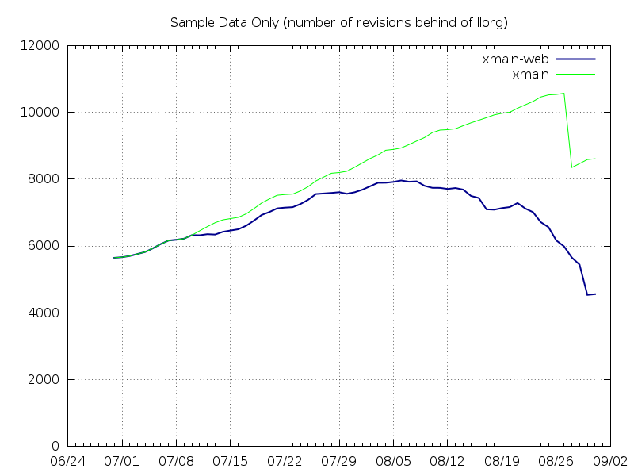

============================
Xmain llorg Pulldown Process
============================

.. contents::
   :local:

Introduction
============

We strive to keep xmain closely synchronized with open source LLVM so that
we can benefit from the latest open source development. At the same time, we
strive to maintain a stable xmain trunk. This document describes the pulldown
process used to achieve these two goals.

At a high level, the procedure for staying synchronized with llorg is as
follows:

#. We maintain a 'merge branch' for merging the latest changes from xmain and
   llorg. We call this branch ``xmain-web``, since we use it to merge content
   from the web.
#. An :ref:`automated tool <automated-merge-tool>` merges change sets one
   at a time from xmain and llvm.org into ``xmain-web``. Manual intervention is
   required to :ref:`resolve conflicts <resolving-conflicts>`.
#. The ``xmain-web`` branch is regularly merged back into xmain following the
   ``xmain-web`` :ref:`promotion process <xmain-web-stabilization>`.

.. _automated-merge-tool:

Automated Merge Tool
====================

We have a constantly running automated tool that polls xmain and llvm.org for
new change sets and merges them into ``xmain-web`` one at a time. For each
change set, the tool attempts to automatically merge the changes and then build
the xmainefi2linux debug compiler. On success, the tool proceeds to the next
change set. On a merge conflict or a build failure, the tool halts the merge
process and notifies an appropriate developer to resolve the problem following
the :ref:`conflict resolution process <resolving-conflicts>`.

Two files in the xmain root directory are used for communicating between
developers and the merge tool.

#. ``merge.status``: When the tool encounters merge conflicts, it writes
   information about the problem to ``merge.status`` and halts the merge
   process. Once the problem is fixed, the developer deletes the contents of
   the file to signal to the merge tool that it is okay to continue.

#. ``build.status``: When the tool encounters a build failure, it writes
   information about the problem to ``build.status`` and halts the merge
   process. Once the problem is fixed, the developer deletes the contents of
   the file to signal to the merge tool that it is okay to continue.
   It is not uncommon for open source developers to break the
   compiler build. These breakages are usually short lived. People will notice
   almost immediately, and the offending change will either get fixed or
   reverted. When we merge the bad change into ``xmain-web``, the merge tool
   will detect the build failure and stop the merge process. What we will
   usually want to do in such cases is unblock the merge tool and allow the
   build to be broken until the change that fixes the build gets merged in.
   Developers signal to the tool that the build is broken by writing the
   40-symbol git-commit-id of the change that is expected to fix the build to
   the first line of ``build.status``. If the designated change fails to fix
   the build, the tool will again halt the merge process and notify developers
   as it would for a normal build breakage. Upon a successful build, the merge
   tool automatically clears the contents of ``build.status``.

.. _resolving-conflicts:

Resolving Conflicts
===================

Notification Process
--------------------
When the merge tool encounters conflicts that it cannot resolve, it halts the
merge process and sends an email notification to a developer, requesting
resolution of the conflict. The pulldown coordinator is copied on the email.
The email contains some details about the conflict and some information about
the conflict resolution process, including the technical details on how to
check out a workspace and check in the changes.

Conflict Resolution BKMs
------------------------
The following git commands are often useful for understanding the cause of the
conflict and how to resolve it.

#. Examine the change set causing the conflict. This command will give you the
   commit message and full diff for the change set.

   .. code-block:: bash

     git show HEAD^2

#. Examine the Intel customizations in the affected files. This command will
   give you the difference between xmain and llorg for the last successful
   merge of ``<file>``.

   .. code-block:: bash

     $ git diff HEAD^1^2 HEAD^1 <file>

   The above command is not bulletproof, because it assumes that the last
   commit to ``xmain-web`` prior to the conflicting merge was a successful
   merge. The following command is more verbose but also more robust.

   .. code-block:: bash

     $ h=`git rev-list --merges -1 HEAD^1`; git diff $h^2 $h <file>

Once you have resolved the conflicts, there are several useful commands to help
you sanity check your changes prior to committing them and uploading them for
review.

#. See the final net effect of merging the most recent change set from
   llvm.org after your conflict resolutions.

   .. code-block:: bash

     $ git diff HEAD^1

   The diffs will often look very similar to the output from

   .. code-block:: bash

     $ git show HEAD^2

#. See the final net Intel customizations for the file after the latest merge
   and after your conflict resolutions.

   .. code-block:: bash

     $ git diff HEAD^2 <file>

   The diffs will often look similar to the output from

   .. code-block:: bash

     $ git diff HEAD^1^2 HEAD^1 <file>

Commits to ``xmain-web``
------------------------
Once you have a patch to resolve a conflict or fix a build you should pass a
component ownwer(s) review. Normally you'll be allowed to commit only after a
review. However there are several exceptions when you can review after a commit:

#. Trivial merge conflict - when a conflict could be resolved by deleting git
   merge support messages and/or line reordering:

   \<\<\<\<\<\<\< HEAD

   \=\=\=\=\=\=\=

   >>>>>>> [commit id]

#. Merge conflict caused by reverted commit (the merge conflict of which was
   previously resolved).

.. _xmain-web-stabilization:

Stabilizing and Promoting ``xmain-web``
=======================================
Periodically, we will want to merge the ``xmain-web`` branch back into xmain.
This section describes that process. At a high level, what we do is as follows.

#. Regularly run xmain checkin testing on the ``xmain-web`` branch.

#. Select a revision of ``xmain-web`` to stabilize. Fast forward the
   ``xmain-cand`` branch to that point.

#. Fix all the issues in ``xmain-cand`` and merge it back into xmain.

Regular ``xmain-web`` Testing
-----------------------------
Once a day, the merge tool will run more extensive testing on the ``xmain-web``
branch. It will specifically run the xmain checkin (xmain_checkin_pulldown)
requirements via alloy, using xmain at the most recent nightly tag as a reference.
The results are sent via email to the pulldown coordinator, who can work with
the development teams to analyze and fix any problems.

If you want to check on the status of in-progress ``xmain-web`` testing, you
can use the ``amt`` tool on Windows and search for jobs with owner
``sys_iclsrc`` that are testing ``xmain-web``.

JIRA Board For Tracking ``xmain-web`` Testing Status
----------------------------------------------------
For every non-trivial issue in ``xmain-web`` that regular testing reveals,
the pulldown coordinator should submit a JIRA tracker to the corresponding
component. The tracker summary should start with ``[xmain-web]`` tag.

The overall progress can be monitored at the following board:
`JIRA xmain-web status board <https://jira01.devtools.intel.com/secure/RapidBoard.jspa?rapidView=10643&view=detail>`_.

Selecting a Revision of ``xmain-web`` to Stabilize
--------------------------------------------------
The pulldown coordinator can decide which revision of ``xmain-web`` is a good
candidate for stabilization and promotion based on the results from regular
alloy testing. Once a revision is selected, the ``xmain-cand`` branch is
updated to that revision using the following process.

   .. code-block:: bash

     $ ics mk xmain-web-ws xmain-web head -git
     <copy the heads.txt attachment from the alloy results to $ICS_WSDIR>
     $ sh update-xmain-cand.sh

Stabilizing and Promoting ``xmain-cand``
----------------------------------------
Fixes for test failures are committed to the ``xmain-cand`` branch. Once all
known failures have been solved, final promotion testing can be done following
the normal branch promotion process, e.g.

   .. code-block:: bash

     $ ics mk xmain-promo-ws xmain head -git
     $ ics merge xmain-cand head
     <Run xmain_checkin_pulldown testing>
     <Request gatekeeper approval>
     $ ics merge -push

For checkin testing requirements, see :ref:`testing-requirements`.

Once promotion is complete, pulldown automation in ``xmain-cand`` (both
auto-merging from ``xmain`` to ``xmain-cand`` and nightly testing) should be
temporarily suspended by adding

   .. code-block:: bash

     HALT until new xmain-cand gets taken

to `<top ws>/merge.status` and `<top ws>/build.status`.

Checkin criteria for ``xmain-cand``
-----------------------------------
Checkin criteria for pulldown is basically the same as for any other change and
the final decision is done by the xmain gatekeeper. The main exception is the
process of addressing performance regressions. Unlike regular checkin requests
we do allow the pulldown to decrease performance and do not require the
coordinators to analyze such regression prior to promotion. Instead a JIRA
against "LLVM Performance Analysis" component should be submitted listing the
performance drops from the Alloy testing. Depending on the current
organizational goals it might be preferred to split the regressions into two
parts - important ones and those that have lower priority.

However, as the scope and effect of work for the pulldown coordinator might
differ from the usual patches he/she works on, here is a brief reference to
judge the quality of the chosen ``xmain-cand`` regarding its stability (as
opposite to generated code performance):

* Any build/LIT-tests failure is a blocking issue.

  - That probably might be weakened for Windows in some special circumstances but
    an explicit approval from the gatekeeper is required for that.

* Any failures in SPEC CPU suites block the pulldown.

* For non-SPEC CPU benchmarks:

  - Compfails with asserts or crashes (SEGV and similar) in the compiler block
    the promotion.

  - Compfails due to valid errors emitted by the FE (especially under `-Werror`
    option) might be allowed by the gatekeeper but the decision will be made on
    a case by case basis. We don't expect such situation to happen often though.

  - Not analyzed runfail obviously block the pulldown. Once analyzed, decision
    is made based on the nature of the runfail. If it's caused by the
    miscompilation or other bug in the compiler, the promotion is blocked.
    Otherwise (issue in the benchmark sources, e.g. due to UB in the source
    code) it's reasonable to ask gatekeeper to approve the promotion even with
    such a runfail.

* Other failures reported/found by the Alloy testing usually do not block the
  promotion unless they're massive. In such cases it's required to create bug
  reports against suspected components and include them into the checkin
  questionnaire.

  Some deeper initial analysis is welcome as it will ease the gatekeeper's work
  on assessing the severeness of the fails and will allow to get an approve for
  the pulldown faster, so such analysis is worth doing.

Xmain Pulldown History
======================

