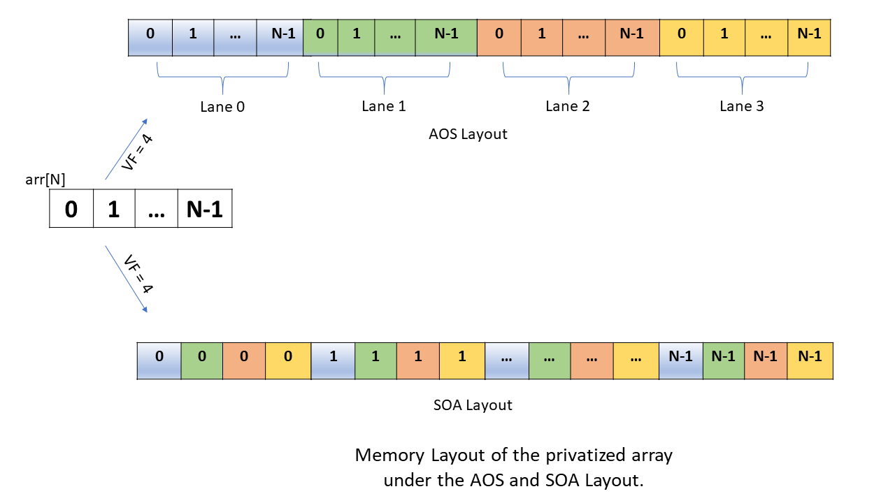
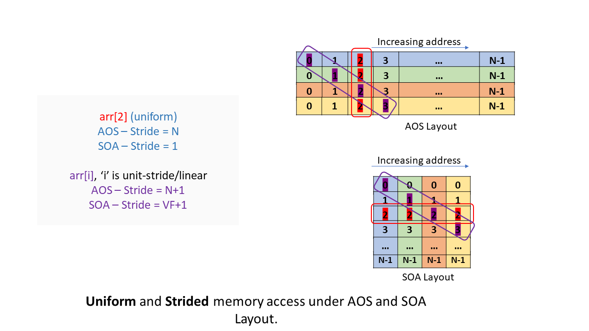

Changes to the Divergence Analysis algorithm for SOA-layout
===========================================================

Loop-privates are typically widened by creating VF-copies of the original type.
There are two approaches to achieving this. In the first approach, referred to
as the `Array-of-Structures` (AOS) layout, this is achieved by extending the
outer-most dimension, i.e., a vector or an array-type of the original type is
created. The other approach, the `Structure-of-Arrays` (SOA) layout, is to create
VF-copies of the the simplest (scalar) types within the given type. This is
widening of the inner-most dimension. The following table demonstrates how
scalar and array-types are widened under the two layouts.

  .. tabularcolumns:: |c|c|c|

+-------------------------+----------------------------------+----------------------------------+
| Type                    |  AOS-layout                      |   SOA-layout                     |
+=========================+==================================+==================================+
|.. code-block:: llvm     |.. code-block:: llvm              |.. code-block:: llvm              |
|                         |                                  |                                  |
| %s = alloca i32         |  %s.vec = alloca <VF x i32>      |  %s.vec = alloca <VF x i32>      |
+-------------------------+----------------------------------+----------------------------------+
|.. code-block:: llvm     |.. code-block:: llvm              |.. code-block:: llvm              |
|                         |                                  |                                  |
| %a = alloca [10 x i32]  | %a.vec = alloca [VF x [10 x i32]]| %a.vec = alloca [10 x <VF x i32>]|
+-------------------------+----------------------------------+----------------------------------+

The diagram below shows how the memory is allocated for widened array types
under the AOS and SOA layouts.

.. _layout-image:

We can broadly classify memory references as *uniform* and *divergent*.
Consider the following C++ code snippet,

.. code-block:: c++

   #define N 1024
   int arr[N];
   int b[N];
   int arr2[N][N];

   int getElement(int n) {
     int i, j, a1, a2, a3, a4, a5, sum;
     a1 = arr[0];
     pragma omp simd private(arr)
     for (i = 0; i < N; ++i) {
       a2 = arr[i];
       a3 = arr[b[i]];
       for (j = 0; j < N; ++j) {
         a4 = arr[j];
         a5 = arr[b[j]];
         arr2[i][j] = (a1 + a2 + a3 + a4 + a5) / 4;
      }
   }
   return arr2[103][100];

Array-reference `arr[j]` in the loop where `j` is uniform, is a uniform
memory reference and array-reference `arr[i]`, where `i` is strided is a
divergent memory reference. Under AOS-layout, the vectorizer always generates
gather/scatter for either of the memory references. This is because of how the
widened memory is allocated under the AOS-layout. The memory-layout
:ref:`figure <layout-image>` shows that under AOS-layout, for either uniform
or divergent memory accesses, we do not access consecutive memory locations.
The memory references are at least `sizeof(arr)` bytes apart in the vectorized
code. For SOA-layout however, we can generate a wide load/store for uniform
memory accesses. In the case of strided memory references, we still end up
generating gather/scatter, but it is superior to the one under AOS-layout on
account of better locality.

.. _access-image:

The array-access :ref:`figure <access-image>` shows the strides for the uniform
and the unit-stride array access case for both the AOS-layout and the
SOA-layout. For uniform memory-access, the stride is `N x sizeof(i32)` bytes
under the AOS-layout and `1 x sizeof(i32)` bytes under the SOA-layout. For the
unit-stride memory access, the stride is `(N+1) x sizeof(i32)` bytes under the
AOS-layout and it is `(VF+1) x sizeof(i32)` under the SOA-layout.

SOA-analysis determines whether a private aggregate variable is safe and profitable
for SOA-layout. SOA-analysis is composed of two distinct analyses. *Escape-analysis*
makes sure that the private variables are not accessed in any way such that the
data-layout transformation would lead to incorrect data-access. The
*Profitability-analysis* is responsible for determining the profitability of the
transformation. SOA-layout for aggregate privates is profitable if there is at least
one memory access which would result in unit-stride access in the vectorized code.
When an aggregate private is deemed as profitable for SOA-layout, we need to
propagate shape and stride information for memory accesses under SOA-layout so
that the CodeGen, amongst other passes, can use that information to generate
optimal code.  SOA-analysis is currently enabled only for scalar types and
array types with scalar element types. The following information is only
applicable for supported types. In the future, we will extend SOA-analysis for
`struct` types, `nested-array`-types or more complex types. With this in mind,
we propose the following additions and changes to the Divergence Analysis
algorithm.

New Shapes
----------
We introduce three new shapes to capture the divergence and the stride information
of loop-private aggregates and their memory accesses under SOA-layout.

* **SOASeq** - Denotes consecutive or unit-stride access of data. The stride, in this case, is the number of bytes of an element of the array.

* **SOAStr** - Denotes strided access of data. The stride, in this case, is `VF` x `Stride`. `Stride` is the stride-value in the scalar code.

* **SOARnd** - Denotes memory accesses that have hard-to-compute stride or random memory access.

To demonstrate how these shapes would be generated and processed in the Divergence-
analysis code, consider the following IR-input coming into the Divergence-analysis
code after privates have been imported. It has GEP-instructions depicting different
memory-access patterns. `arr.priv` is a private array variable of type
`[1024 x i32]`.

.. code-block:: llvm

    for.body:
      %iv1 = phi i64 [ 0, %for.preheader ], [ %iv1.next, %for.body ]

      ; Strided first index, should result in a random GEP.
      %rnd.gep1 = getelementptr inbounds [1024 x i32], [1024 x i32]* %arr.priv
                                                     , i64 %iv1, i64 0

      ; Uniform GEP-chain on non-private array followed by a load.
      %uni.g.gep1 = getelementptr inbounds [1024 x i32], [1024 x i32]* @arr
                                                       , i64 0, i64 0
      %uni.g.gep2 = getelementptr inbounds i32, i32* %uni.g.gep1, i64 0
      %non.priv.uni.ld = load i32, i32* %uni.g.gep2, align 4
      %idxprom1 = sext i32 %non.priv.uni.ld to i64

      ; Strided GEP-chain on non-private array followed by a load.
      %str.g.gep1 = getelementptr inbounds [1024 x i32], [1024 x i32]* @arr
                                                       , i64 0, i64 %iv1
      %str.g.gep2 = getelementptr inbounds i32, i32* %str.g.gep1, i64 %iv1
      %non.priv.str.ld = load i32, i32* %str.g.gep2, align 4
      %idxprom2 = sext i32 %non.priv.str.ld to i64

      ; Uniform GEPs on private array.
      ; Sequence of unit-stride GEPs which result in Uniform mem-access
      %uni.gep1 = getelementptr inbounds [1024 x i32], [1024 x i32]* %arr.priv
                                                     , i64 0, i64 0
      %uni.gep2 = getelementptr inbounds i32, i32* %uni.gep1, i64 0
      %priv.ld.1 = load i32, i32* %uni.gep2, align 4

      ; GEP using the loaded index from non-private array, something similar to a[b[i]].
      %uni.indirect.gep1 = getelementptr inbounds [1024 x i32], [1024 x i32]* %arr.priv
                                                              , i64 0, i64 %idxprom1
      %uni.indirect.gep2 = getelementptr inbounds i32, i32* %uni.gep1, i64 %idxprom1

      ; Sequence of unit-stride GEPs which result in Strided-memory access.
      %str.gep1 = getelementptr inbounds [1024 x i32], [1024 x i32]* %arr.priv
                                                     , i64 0, i64 %iv1
      %str.gep2 = getelementptr inbounds i32, i32* %str.gep1, i64 %iv1

      ; GEP using the loaded index from non-private array, something similar to a[b[i]].
      %str.indirect.gep1 = getelementptr inbounds [1024 x i32], [1024 x i32]* %arr.priv
                                                              , i64 0, i64 %idxprom2
      %str.indirect.gep2 = getelementptr inbounds i32, i32* %uni.indirect.gep1, i64 %idxprom2

      %iv1.next = add nuw nsw i64 %iv1, 1
      %cmp = icmp ult i64 %iv1.next, 1024
      br i1 %cmp, label %for.body, label %for.end
    for.end:                                          ; preds = %for.body

The default layout for the array is AOS. The DA algoithm is run first assuming
AOS-layout. We can examine the shapes determined by DA based on that assumption.
They are as follows,

.. code-block:: llvm

    Uniform: [Shape: Uniform] i64 %vector.loop.iv = phi  [ i64 0, BB1 ],  [ i64 %vector.loop.iv.next, BB2 ]
    Divergent: [Shape: Unit Stride, Stride: i64 1] i64 %iv1 = phi  [ i64 %iv1.ind.init, BB1 ],  [ i64 %iv1.next, BB2 ]
    Divergent: [Shape: Random] i32* %rnd.gep1 = getelementptr inbounds [1024 x i32]* %arr.priv i64 %iv1 i64 0
    Uniform: [Shape: Uniform] i32* %uni.g.gep1 = getelementptr inbounds [1024 x i32]* @arr i64 0 i64 0
    Uniform: [Shape: Uniform] i32* %uni.g.gep2 = getelementptr inbounds i32* %uni.g.gep1 i64 0
    Uniform: [Shape: Uniform] i32 %non.priv.uni.ld = load i32* %uni.g.gep2
    Uniform: [Shape: Uniform] i64 %idxprom1 = sext i32 %non.priv.uni.ld to i64
    Divergent: [Shape: Strided, Stride: i64 4] i32* %str.g.gep1 = getelementptr inbounds [1024 x i32]* @arr i64 0 i64 %iv1
    Divergent: [Shape: Random] i32* %str.g.gep2 = getelementptr inbounds i32* %str.g.gep1 i64 %iv1
    Divergent: [Shape: Random] i32 %non.priv.str.ld = load i32* %str.g.gep2
    Divergent: [Shape: Random] i64 %idxprom2 = sext i32 %non.priv.str.ld to i64
    Divergent: [Shape: Strided, Stride: i64 4096] i32* %uni.gep1 = getelementptr inbounds [1024 x i32]* %arr.priv i64 0 i64 0
    Divergent: [Shape: Strided, Stride: i64 4096] i32* %uni.gep2 = getelementptr inbounds i32* %uni.gep1 i64 0
    Divergent: [Shape: Random] i32 %priv.ld.1 = load i32* %uni.gep2
    Divergent: [Shape: Strided, Stride: i64 4096] i32* %uni.indirect.gep1 = getelementptr inbounds [1024 x i32]* %arr.priv i64 0 i64 %idxprom1
    Divergent: [Shape: Strided, Stride: i64 4096] i32* %uni.indirect.gep2 = getelementptr inbounds i32* %uni.gep1 i64 %idxprom1
    Divergent: [Shape: Random] i32* %str.gep1 = getelementptr inbounds [1024 x i32]* %arr.priv i64 0 i64 %iv1
    Divergent: [Shape: Random] i32* %str.gep2 = getelementptr inbounds i32* %str.gep1 i64 %iv1
    Divergent: [Shape: Random] i32* %str.indirect.gep1 = getelementptr inbounds [1024 x i32]* %arr.priv i64 0 i64 %idxprom2
    Divergent: [Shape: Random] i32* %str.indirect.gep2 = getelementptr inbounds i32* %uni.indirect.gep1 i64 %idxprom2

Once SOA-analysis is performed and any array is determined to be profitable for
SOA-layout, we have to run DA assuming SOA-layout. SOA-layout results in what
appears as *uniform* access in the input IR becoming unit-stride in the vectorized
code (represented by the `SOASeq` shape) and *strided* access in the input IR
becoming *strided* in the vectorize code (represented either by the `SOAStr` or
the `SOARnd` shape). The DA dumps after SOA-shape propagation would look like,

.. code-block:: llvm

    Uniform: [Shape: Uniform] i64 %vector.loop.iv = phi  [ i64 0, BB1 ],  [ i64 %vector.loop.iv.next, BB2 ]
    Divergent: [Shape: Unit Stride, Stride: i64 1] i64 %iv1 = phi  [ i64 %iv1.ind.init.26896, BB1 ],  [ i64 %iv1.next, BB2 ]
    Divergent: [Shape: SOA Random] i32* %rnd.gep1 = getelementptr inbounds [1024 x i32]* %arr.priv i64 %iv1 i64 0
    Uniform: [Shape: Uniform] i32* %uni.g.gep1 = getelementptr inbounds [1024 x i32]* @arr i64 0 i64 0
    Uniform: [Shape: Uniform] i32* %uni.g.gep2 = getelementptr inbounds i32* %uni.g.gep1 i64 0
    Uniform: [Shape: Uniform] i32 %non.priv.uni.ld = load i32* %uni.g.gep2
    Uniform: [Shape: Uniform] i64 %idxprom1 = sext i32 %non.priv.uni.ld to i64
    Divergent: [Shape: Strided, Stride: i64 4] i32* %str.g.gep1 = getelementptr inbounds [1024 x i32]* @arr i64 0 i64 %iv1
    Divergent: [Shape: Random] i32* %str.g.gep2 = getelementptr inbounds i32* %str.g.gep1 i64 %iv1
    Divergent: [Shape: Random] i32 %non.priv.str.ld = load i32* %str.g.gep2
    Divergent: [Shape: Random] i64 %idxprom2 = sext i32 %non.priv.str.ld to i64
    Divergent: [Shape: SOA Unit Stride, Stride: i64 4] i32* %uni.gep1 = getelementptr inbounds [1024 x i32]* %arr.priv i64 0 i64 0
    Divergent: [Shape: SOA Unit Stride, Stride: i64 4] i32* %uni.gep2 = getelementptr inbounds i32* %uni.gep1 i64 0
    Divergent: [Shape: Random] i32 %priv.ld.1 = load i32* %uni.gep2
    Divergent: [Shape: SOA Unit Stride, Stride: i64 4] i32* %uni.indirect.gep1 = getelementptr inbounds [1024 x i32]* %arr.priv i64 0 i64 %idxprom1
    Divergent: [Shape: SOA Unit Stride, Stride: i64 4] i32* %uni.indirect.gep2 = getelementptr inbounds i32* %uni.gep1 i64 %idxprom1
    Divergent: [Shape: SOA Strided, Stride: VF x i64 4] i32* %str.gep1 = getelementptr inbounds [1024 x i32]* %arr.priv i64 0 i64 %iv1
    Divergent: [Shape: SOA Strided, Stride: ?] i32* %str.gep2 = getelementptr inbounds i32* %str.gep1 i64 %iv1
    Divergent: [Shape: SOA Random] i32* %str.indirect.gep1 = getelementptr inbounds [1024 x i32]* %arr.priv i64 0 i64 %idxprom2
    Divergent: [Shape: SOA Random] i32* %str.indirect.gep2 = getelementptr inbounds i32* %uni.indirect.gep1 i64 %idxprom2

Note the `VF x i64 Stride` for SOAStr shape. This is strictly a prettyprint at
this point. For all practical purposes, [Shape: SOAStr, Stride: VF x i64 4]
and [Shape: SOARandom] are the same and would result in gather/scatter during
codegen, but the former will aid in cost-modeling. This is a follow-up task for
SOAShapes. The first implementation of SOAShapes will not represent strides in
terms of VF.

The codegen for the shapes assuming VF=4 would be as follows,

.. code-block:: llvm

    %arr.priv = alloca [1024 x i32]

is transformed into:

.. code-block:: llvm

    %arr.priv.vec = alloca [1024 x <4 x i32>]

**SOASeq**:

.. code-block:: llvm

    %uni.gep1 = getelementptr inbounds [1024 x i32], [1024 x i32]* %arr.priv
                                                   , i64 0, i64 0

is transformed into:

.. code-block:: llvm

    %wide.uni.gep1 = getelementptr inbounds [1024 x <4 x i32>], [1024 x <4 x i32>]* %arr.priv.vec
                                                              , i64 0, i64 0

**SOAStr**:

.. code-block:: llvm

    %str.gep1 = getelementptr inbounds [1024 x i32], [1024 x i32]* %arr.priv
                                                   , i64 0, i64 %iv1

is transformed into:

.. code-block:: llvm

    %wide.str.gep1 = getelementptr inbounds [1024 x <4 x i32>], [1024 x <4 x i32>]* %arr.priv.vec
                                                              , <i64 0, i64 0, i64 0, i64 0>
                                                              , <i64 %iv1, i64  %iv+1, i64 %iv+2, i64 %iv+3>
                                                              , <i64 0, i64 1, i64 2, i64 3>

**SOARnd**:

.. code-block:: llvm

     %ld.2 = load i64, i64* %uni.gep4, align 4

     %rnd.gep1 = getelementptr inbounds [1024 x i32], [1024 x i32]* %arr.priv
                                                    , i64 0
                                                    , i64 %ld.2

is transformed into:

.. code-block:: llvm

    %wide.load = load/gather ...
    %wide.rnd.gep1 = getelementptr inbounds [1024 x <4 x i32>], [1024 x <4 x i32>]* %arr.priv.vec
                                                              , <i64 0, i64 0, i64 0, i64 0>
                                                              , %wide.load
                                                              , <i64 0, i64 1, i64 2, i64 3>

Changes to DA
-------------

GEP instruction has to be specially handled in the new DA algorithm.
For array aggregate variables identified for SOA-layout, narrowing
or widening casts leading to load/store are not possible. Given this, we
propose the following changes to the GEP-conversion table in DA,

.. tabularcolumns:: |c|c|c|c|c|c|

+------------+--------+-------+--------+--------+-------+
| ptr\\index | Uni    | Seq   | Str    | Rnd    | Undef |
+============+========+=======+========+========+=======+
| Uni        | Uni    | Str   | Str    | Rnd    | Undef |
+------------+--------+-------+--------+--------+-------+
| Seq        | Str    | Rnd   | Rnd    | Rnd    | Undef |
+------------+--------+-------+--------+--------+-------+
| Str        | Str    | Rnd   | Rnd    | Rnd    | Undef |
+------------+--------+-------+--------+--------+-------+
| Rnd        | Rnd    | Rnd   | Rnd    | Rnd    | Undef |
+------------+--------+-------+--------+--------+-------+
| SOASeq     | SOASeq | SOAStr| SOARnd | SOARnd | Undef |
+------------+--------+-------+--------+--------+-------+
| SOAStr     | SOAStr | SOAStr| SOARnd | SOARnd | Undef |
+------------+--------+-------+--------+--------+-------+
| SOARnd     | SOARnd | SOARnd| SOARnd | SOARnd | Undef |
+------------+--------+-------+--------+--------+-------+
| Undef      | Undef  | Undef | Undef  | Undef  | Undef |
+------------+--------+-------+--------+--------+-------+
