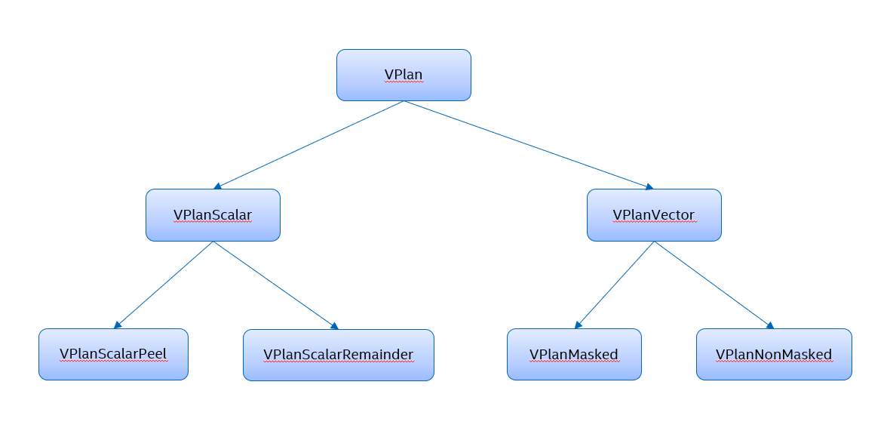

======================================
VPlan Vectorizer Overview and Pipeline
======================================

.. contents::
   :local:

.. include:: <isogrk1.txt>

Introduction
============

The VPlan Vectorizer is a complex component that can be difficult for those new to it to
understand.  The purpose of this document is to provide a broad overview of the Vectorizer's
design, together with motivations of various design choices where these may not be obvious.
Documentation can always be improved, so if you have questions that aren't answered by this
document, please give feedback to the Vectorizer team.

This document does *not* attempt to describe every aspect of the VPlan Vectorizer in great
detail.  As our documentation grows, links to more detailed explanations will be provided
herein.

The intended audience is developers who have a basic understanding of compiler optimization,
but may not be fully versed in loop vectorization.

VPlan and the xmain Pass Pipeline
=================================

`Figure 1`_ shows how vectorization fits within the xmain pass pipeline.  Note that there are
many components that perform some aspect of producing vectorized code.

.. _Figure 1:

   Figure 1: Vectorizer components in the xmain compilers

There are two loop vectorizers shown in `Figure 1`_:  ``VPlan``, which is Intel's proprietary
loop vectorizer, and ``LoopVectorize``, which is the LLVM community loop vectorizer.  Observe
that ``VPlan`` may be invoked at two different points during compilation.  As we will see,
``VPlan`` is also invoked to process code in two very different intermediate representations.

For C/C++ and Fortran programs being compiled with high levels of optimization, the usual path
is for Intel's proprietary loop optimization package to process all loops in the compilation
unit.  The Loop Optimizer comprises a large number of optimizations on loops and loop nests.
The Loop Optimizer has developed its own intermediate representation for code in the
regions under consideration, known as HIR (High-level Intermediate Representation).

Along this path, ``VPlan`` is considered one of the many Loop Optimizer passes.  Therefore it
must be capable of consuming and emitting HIR code.

In cases where the Loop Optimizer is not invoked, and the source code contains explicit OpenMP
(OMP) SIMD
loops (see below), ``VPlan`` must still attempt to vectorize these loops.  Along this path,
``VPlan`` is called as part of the LLVM pass pipeline that operates on the LLVM IR intermediate
representation.  So ``VPlan`` must also be capable of consuming and emitting LLVM IR.  Note that
this invocation of ``VPlan`` *only* processes explicit SIMD loops, for reasons that will be made
clear.

The Loop Optimizer may not be invoked for a variety of reasons.  For example, it doesn't
execute at ``-O0`` or ``-O1`` optimization levels, and it can be disabled from the command
line.  Further details may be found in the Loop Optimizer documentation and code.

There is one case where a loop may be processed by ``VPlan`` along both paths.  When called
from the Loop Optimizer, ``VPlan`` performs a number of legality checks before vectorizing
a loop.  One of these checks may fail, and if this is an explicit SIMD loop, the user expects
the compiler to be able to vectorize it.  In this case, ``VPlan`` will be invoked again later
along the LLVM IR path.  After the change in representation and a number of additional
optimizations, ``VPlan`` may manage to vectorize the loop after all.  If not, then the user
is informed that the explicit SIMD loop could not be vectorized, and why.

When ``VPlan`` successfully optimizes a loop as part of the Loop Optimizer, loop metadata is
added to the optimized loops indicating that the loops should not be vectorized again.  This
is necessary to avoid problems when either ``VPlan`` or the community vectorizer is invoked
on LLVM IR later in the pipeline.

There are two components in `Figure 1`_ that have not yet been described.  ``SLPVectorize`` is
another community component that looks for the opportunity to form vector operations from scalar
operations in straight-line code and extended basic blocks, both within and outside of loops.
This is run on all code at optimization level ``-O2`` or above, except for DPC++ and OpenCL code.
(Neither the community loop vectorizer nor the SLP vectorizer is part of the "SYCL pipeline.")
SLP runs after all the loop vectorizers to avoid interfering with the (usually) more valuable loop
vectorization optimization.

The ``VecClone`` component is used to provide vectorized versions of entire functions, or of
SYCL, OpenCL, or OpenMP kernels.  (OpenMP kernels are processed only when
``-fopenmp-target-simd`` is present on the command line.)
Details are beyond the scope of this document, but essentially
``VecClone`` introduces a loop around the function body to convert the function/kernel
vectorization problem into a loop vectorization problem.  Additionally, the Intel Vector
ABI must be honored when creating vectorized functions, with appropriate name mangling and
argument passing.

`Figure 1`_ refers to automatic and explicit vectorization.  Explicit vectorization occurs when
the source code identifies loops that the user expects to be vectorized (referred to as "explicit
SIMD loops").  The most common way to identify such a loop is with the OpenMP directive
``#pragma omp simd``.  Another possibility is to use the less portable ``#pragma vector always``.
(The syntax for these directives is different for Fortran.)  The compiler is obligated to
vectorize an explicit SIMD loop if at all possible, and to report a warning to the user if
it was unable to do so.

The compiler may also perform automatic vectorization, also known as auto-vectorization, for
loops that are not explicit SIMD loops.  Along the HIR path, the Loop Optimizer performs
extensive data and control dependence checks to prove whether or not a loop is legal to
vectorize.  If these dependence checks (as well as the vectorizer's own legality checks) are
satisfied, ``VPlan`` will determine whether or not it is expected to be profitable to vectorize
the loop (i.e., whether the vectorized loop will execute faster than the original loop).  If so,
vectorization occurs.  The user may find out which loops have been vectorized by requesting
an optimization report.

Along the LLVM IR path, ``VPlan`` does not currently perform auto-vectorization, because this
requires duplicating the dependence checking performed by the Loop Optimizer.  This may change
in the future.  At the moment, ``VPlan`` defers to the community loop vectorizer for any
auto-vectorization when the Loop Optimizer is not invoked.  ``VPlan`` for LLVM IR only
optimizes explict SIMD loops.

The VPlan Model
===============

The ``VPlan`` Vectorizer represents a loop nest to be considered for vectorization using a model
that is also called a ``VPlan``.  (The meaning of ``VPlan`` should always be clear from context.)
The ``VPlan`` model was designed with the following principles in mind:

* The ``VPlan`` representation should be independent from the input representation.  The differences
  between HIR and LLVM IR (and any other future IR) make this a necessity.

* No changes should be made to the input IR until after a final vectorization decision is reached.

* The model must support building multiple ``VPlans`` for the loop nest, with cost modeling based on
  the target architecture used to determine the best alternative.

* Individual instructions in the model (represented by the ``VPInstruction`` class and its
  subclasses) do not differ depending on whether they will remain scalar instructions or become
  vector instructions. No instructions actually become vector instructions until the Code
  Generation stage of the Vectorizer, when each ``VPInstruction`` is translated to output IR
  using the same representation as the input.

* A ``VPlan`` represents an entire loop nest.  Although today the Vectorizer makes vectorization
  decisions one loop at a time, this allows future flexibility to compare different choices of which
  loops in a nest to vectorize and select the most efficient combination.

`Figure 2`_ shows the VPlan model at a very high level.  First the input IR is transformed into
the VPlan IR, creating the initial VPlan.  Multiple transformation steps are performed at the
VPlan level.  After all transformation steps are complete, the final VPlan IR is transformed
into the same form as the input IR.

.. _Figure 2:
.. figure:: VPlanModel.png
   :scale: 65%
   :alt: VPlan Model (diagram)
   :align: center

   Figure 2: The VPlan Model

External Dependencies
=====================

The Paropt component identifies regions of interest for parallelization and vectorization
opportunities along both the HIR path and the LLVM IR path.  It forms a hierarchical graph of
"work regions," each of which is represented by a ``WRegionNode``.  Regions that are analyzed
to embody vectorizable loops are represented by the ``WRNVecLoopNode`` subclass.  These are
the only regions of interest to the vectorizer.

Along the HIR path, the Loop Optimizer performs detailed dependence analysis and control flow
analysis to identify loops that are legal to automatically vectorize, and annotates them with
directives requesting that they be vectorized.  There is no such mechanism today along the
LLVM IR path, which only handles explicit SIMD loops.

.. _VPlan Framework:

The VPlan Framework
===================

`Figure 3`_ shows the VPlan pipeline in slightly more depth.  Before creating the initial VPlan,
the Vectorizer first performs a number of legality tests to ensure that the VPlan model is
capable of vectorizing the requested loop nest.  These tests differ somewhat between the LLVM IR
and HIR paths, since the Loop Optimizer has already performed a great deal of legality checking
before invoking the Vectorizer.  Legality also records explicitly declared information from any
SIMD directive that was present on the loop, including loop entities (such as reductions, privates,
and linears, the last of which includes inductions).  The entities themselves must be checked for
legality and for support, since the Vectorizer may not yet support all aspects of the OpenMP
specification.

.. _Figure 3:

   Figure 3: The VPlan Pipeline

The initial VPlan is built by translating the incoming IR into the VPlan control flow graph (CFG)
format.  This is done in multiple stages:

* *CFG construction*.  The Vectorizer makes a copy of the incoming control flow graph and
  creates ``VPInstruction`` objects to represent instructions from the incoming IR.  Each
  ``VPInstruction`` resides in a ``VPBasicBlock``.  The CFG is created in static single assignment
  (SSA) form.

* *Loop analysis*.  The CFG is analyzed using standard LLVM interface extensions, producing a
  hierarchy of ``VPLoop`` objects.

* *Entity transformation*.  The loop entities that were imported during Legality are each
  represented in the CFG with a series of ``VPInstruction`` objects.  Typically this requires
  instructions in the pre-header and post-exit blocks of the loop, and may also include
  instructions executed in the loop body.  The Vectorizer also ensures that there is an explicit
  uniform vector loop induction variable.

* *CFG canonicalization*.  When vectorizing a non-innermost loop, the control flow of the inner
  loop(s) is transformed if necessary.

  Single-exit ``while`` loops (with the iteration test in the header block) are converted to
  single-exit ``do-until`` loops (with the iteration test in the loop latch).  Also, inner loops
  with multiple exits have their exits merged to form a single exit.  Before predication, the
  non-uniform back edges in inner loops are transformed into uniform ones, adding the required
  masks in the loop bodies and inserting special instructions to check all bits in divergent
  conditions.

The remaining steps in `Figure 3`_ are described a little later in this document.

The VPlan CFG data structures were designed to leverage existing extensible analyses in the LLVM
framework.  For example, detecting and representing loops is done by making ``VPLoop`` a subclass
of ``llvm::LoopBase`` and making ``VPLoopInfo`` a subclass of ``llvm::LoopInfoBase``, and then
invoking the existing loop analyzer.  The Vectorizer also implements the ``llvm::GraphTraits``
specialization for ``VPLoop`` objects.  All of LLVM's CFG traversal algorithms can be used
directly on the VPlan CFG.

Every ``VPBasicBlock`` has an explicit *terminator* instruction, indicating the control flow
that occurs at the end of the block.  That is, there are no implicit fall-through semantics,
so blocks can be reordered at will.

The ``VPInstruction`` class hierarchy (rooted at ``VPValue``) is likewise designed to mirror the
LLVM framework.  `Figure 4`_ shows a subset of this hierarchy.  Each class in the top three layers
has an LLVM counterpart whose name is formed by dropping the "VP", and the inheritance structure
is the same.  The bottom layer shows examples of subclasses of ``VPInstruction``, which may have
no direct LLVM counterpart.  Additionally, when no special semantics are required, a
``VPInstruction`` may simply have an opcode from LLVM's ``Instruction`` class.  For example, all
simple arithmetic operations are handled this way.

.. _Figure 4:

   Figure 4: VPValue and its Subclasses

``VPValue`` is the base class of def-use chains within a ``VPlan``, and represents any kind of
value.  This may include live-in values, live-out values, constants, etc., as well as all
``VPInstruction`` objects.  A ``VPUser`` inverts the def-use relationship.  ``VPExternalDef`` and
``VPExternalUse`` represent values that are live on entry to the ``VPlan`` initial entry block and
live on exit from the ``VPlan`` final exit block, respectively.  ``VPLiveInValue`` and
``VPLiveOutValue`` (not shown) are similar, but wrap incoming and outgoing values associated with
loop entities.

The constructed control flow graph is stored as part of the initial ``VPlan`` object.  `Figure 5`_
shows a subset of the ``VPlan`` class hierarchy.  The ``VPlanScalar`` subclass is used for
modeling scalar peel loops and scalar remainder loops associated with a vectorized loop.  Each
of these has its own subclass.  Peeling is generally done for alignment of a particular set of
memory references, and remainder loops handle leftover iterations when a loop's iteration count
(adjusted for any peeling) may not be evenly divided by the vectorization factor.  A
``VPlanVector`` subclass is used for variations of a ``VPlan`` that we want to model as being
vectorized.  For example, this decision may be made for remainder loops.  A ``VPlanVector`` has
``VPlanMasked`` and ``VPlanNonMasked`` subclasses; an example of a ``VPlanMasked`` is a remainder
loop that we've modeled to vectorize using predicate-mask instructions, where the run-time mask
determines how many scalar iterations remain to be handled by the masked remainder loop.

.. _Figure 5:

   Figure 5: The VPlan Class and its Subclasses

Analysis and Transformation Pipeline
====================================

Once the initial VPlan has been built, a variety of analyses and transformations take place.
Additional ones will undoubtedly be added over time, but here's a rough outline of the
VPlan pipeline as it stands today.

* Legality checks

* Build initial VPlan

  * CFG construction and loop analysis

  * Loop entities lowering transformation

  * Loop canonicalization

* Calculate scalar (VF=1) cost of VPlan

* Early-exit loop transformation

* Scalar evolution analysis

* Value tracking analysis

* Dominator and post-dominator analysis

* Divergence analysis (DA)

* Struct-of-array (SOA) analysis and recomputation of DA

* Restrict VF and UF for special cases

* Pre-predication peephole

* Create masked-mode VPlan variants

* Loop-closed SSA transformation

* Loop control-flow uniformity transformation

* Predication and linearization

* VConflict idiom transformation (HIR only)

* Select the best plan (cost modeling of scenarios)

* Select the best unroll factor

* Create auxiliary VPlans (peel/remainder loops)

* For each VPlan (main + auxiliary):

  * Insert all-zero bypasses

  * Propagate alignment from guaranteed peel (LLVM IR only)

  * Lower tree conflicts (HIR only)

  * Unroll (main loop only)

  * SOA transformation (LLVM IR only)

  * Emit optimization report remarks

* Emit the peel and remainder loops (CFG merging)

* SSA deconstruction (HIR only)

* VLS transformation

* Function call vectorization analysis

* Library call transformation

* Scalar/vector analysis (SVA)

* Code generation

There is also a *VPlan Verifier* utility that runs several times during the Vectorizer pipeline,
to ensure that transformations have left the ``VPlan`` in a legal and self-consistent state.

A detailed description of each of the above topics is beyond the scope of this document, but here
is a brief overview.

Early-Exit Loop Transformation
------------------------------

The early-exit loop transformation transforms vectorizable multiple-exit loops into equivalent
single-exit loops that can be consumed by the VPlan framework.  At this writing, it is a work in
progress.  This will gradually replace the ad-hoc idiom recognition for search loops that has
been in place as a stopgap solution.

Divergence Analysis and Prerequisites
-------------------------------------

:doc:`DivergenceAnalysis` (DA) analyzes the behavior of values within a vector. These behaviors
are referred to as *shapes*, which include *uniform* (identical in all lanes of a vector),
*strided* (increasing or decreasing by a fixed amount), and *random* (unknown shape), along with
various other shapes associated with SOA analysis (below). DA is used throughout the vectorizer,
in such phases as All-Zero Bypass, Loop CFU, Code Generation, and many more.  Thus DA is computed
early in the process, and it provides interfaces to recalculate part or all of its results.

DA is built upon several standard compiler analyses that have been tailored for ``VPlan``.

* *Scalar Evolution* analyzes chains of recurrences within a loop.  Within the vectorizer we are
  most interested in linear recurrences such as ``{0,+,1}``, describing a variable that starts at
  0 and is incremented by 1 during each iteration of a loop.

* *Value Tracking* analysis is used to calculate known bits of ``VPValue`` objects.  For example,
  knowing that some number of rightmost bits of an address are 0 proves that the address points
  to an object aligned on the corresponding power-of-two boundary.

* *Dominator and Post-Dominator* analysis identifies forward and backward control dependence
  relationships in the control flow graph.  ``X`` dominates ``Y`` iff ``Y`` can only execute if
  ``X`` has already executed.  ``Y`` post-dominates ``X`` iff ``Y`` will always execute if ``X``
  has executed.

Struct-of-Array Analysis and Transformation
-------------------------------------------

*Struct-of-Array* (SOA) analysis determines whether it is legal and profitable to change the data
layout of loop privates. A common programming idiom is to create arrays whose elements are
structures of more than one scalar field. When algorithms access individual structure fields
across such an array, the access patterns are strided by the size of the structure, which may
be a large value. Typically vectorizing such accesses requires gather loads and scatter stores.

Loop privates are copies of data that are not externally visible. When creating loop privates,
the vectorizer has the freedom to represent the data differently. Specifically, we can convert
an array of structs into a special representation, struct of vectors, where there is a separate
vector for each element of the struct.  The accesses to these special structures in vectorized
code are much more efficient when the common access pattern is accessing the same struct field
in each array element.  For example, suppose we have an array ``struct S { int a; double d; }
A[N];`` and access ``A[i].d`` in the loop.  The straightforward vectorization of that access
leads to a strided load/store.  But if we convert the struct into ``struct VecS { <VF x int>
vec_a; <VF x double> vec_b; }`` and have a private copy that is an array of the new structures,
the access above becomes a consecutive load/store, which is much more efficient.  Note that this
is also done for single-element private arrays (i.e., scalar privates): during vectorization we
will create ``VF`` copies of such private arrays.  More information can be found in
`SOA presentation`_.

.. _SOA presentation: https://intel.sharepoint.com/:p:/r/sites/CompilerEngineeringCE/Shared Documents/CE Vectorizer/Technical Presentations/2019/SOA CodeGen.pptx?d=wab837622e7f64b8eb9eb69a5fad3c5fb&csf=1&web=1&e=FxRv8M

Results of SOA analysis are incorporated into DA data.  So if SOA analysis decides to transform
any loop private, DA results are fully recalculated.

The results of SOA analysis are used to determine memory access patterns during cost modeling.
There is a special transformation to materialize the results of SOA analysis, to simplify
code generation.  This transformation is executed after cost modeling and before code generation.

Defining Possible Vectorization and Unroll Factors
--------------------------------------------------

Later in the Vectorizer pipeline, cost modeling will compare the expected performance of the
``VPlan`` under consideration using a variety of *vectorization factors* and *unroll factors*.
A vectorization factor (VF) indicates how many scalar iterations of a loop body correspond to
a single iteration in its vectorized counterpart.  For example, one way to vectorize a loop
that operates on 64-bit double-precision values is to use 256-bit vectors with a VF of 4.
The four lanes of the vectors will perform the computations of four iterations of the scalar
loop body.

Along with vectorization, the Vectorizer may choose to unroll a loop.  The unroll factor (UF)
indicates how many times the loop will be unrolled.

By default, the vectorizer will consider all VFs that are powers of 2 between minimum and
maximum values that depend on the minimum and maximum vector register size of the target
processor and the data types used in the loop (excluding structs).  The minimum is selected
as the minimum vector register size divided by the width of the widest data type in the loop,
and the maximum is selected as the maximum vector register size divided by the width of the
narrowest data type used in the loop.  For example, for AVX512 with double and char data types
used in the loop, we will have the range [2, 4, 8, 16, 32, 64].  The range for UF is selected
as a small set of power-of-2 UF values below a default maximum (8).  However, for a variety of
reasons, we may want to exclude some of these choices.  User directives or compile options may
have forced specific values for VF and/or UF.  Or we may know the exact value of the loop's
*trip count* (number of iterations), which may be smaller than some of the VF/UF possibilities.
There are many other cases.  At this stage of the pipeline, the Vectorizer considers these
constraints and produces a subset of VFs and UFs to model.

Early Peephole Optimization
---------------------------

Prior to running the predication phase, there is a peephole optimization phase to canonicalize
code sequences to improve cost modeling and other analyses and transformations.
Currently there is only one
such peephole optimization, which replaces a truncate followed by a zero-extend with the
corresponding logical AND operation.

Masked-Mode VPlan Variants
--------------------------

As mentioned in `VPlan Framework`_ and `Figure 5`_, one of the subclasses of ``VPlan`` is
``VPlanMasked``, which represents a version of the loop that uses a predicate mask to control
which vector lanes produce a result.  This is most often used for remainder loops, but can also
be used for the main loop if it has a small known trip count.  A ``VPlanMasked`` requires some
small changes in representation, so at this stage in the pipeline, the initial ``VPlan`` is
cloned and the clone is converted into the masked variant representation.

Loop-Closed SSA Transformation
-------------------------------

The predicator and other subsequent transformations require that the ``VPlan`` be not only in
SSA form, but in a specialized form known as *loop-closed SSA form*.  See the
`LLVM description of LCSSA`_ for more details.  The transformation in ``VPlan`` is a
simplified version based on the LLVM IR implementation.  Simplification is possible by asserting
that the transformation is run only on loops with a single exit.

.. _LLVM description of LCSSA: https://llvm.org/docs/LoopTerminology.html#loop-closed-ssa-lcssa

Loop Control Flow Uniformity (CFU) Transformation
-------------------------------------------------

The Loop CFU transform ensures that all back edges for an innermost loop have uniform control
flow. This is done by replacing any divergent condition in a latch block with an all-zero-check
instruction and introducing a mask controlling execution of the original loop body.  That is,
the original loop body is guarded by a new header block that checks whether the loop body should
be executed.  If the loop is vectorized, only those lanes for which the latch branch would have
been taken will be executed under the mask, and the latch branch will be taken if and only if
it would be taken for at least one of the corresponding scalar iterations.  The original
divergent condition is used to form the mask.

Predication and Linearization
-----------------------------

The purpose of the linearization transform is to replace divergent control flow inside
candidate loops with masked execution of instructions in each basic
block.  For example, a simple ``if-then-else`` sequence with a single block in the ``then``
and ``else`` clauses, with control flow controlled by a predicate `P`, is converted into a
sequence of two blocks that are always executed, the first under a mask encoding those
iterations on which `P` is true, and the second under the inversion of that mask.  The
"flattening" of the CFG is referred to as *linearization*, and the introduction of masks
is known as *predication*.  As you can see, the linearization is based on predication.
The real "jumps" in the vectorized code are possible only when all bits in the mask have
the same value, so in general linearization is one of the essential vectorization
transformations.

It should now be clear why the Loop CFU Transformation is needed to remove divergent back
edges.  Linearization converts divergent branches in the loop into predicate masks so that
all blocks in the loop are executed under the appropriate masks; computations in those
blocks only occur for active lanes.  But the final branch in the loop is a back edge that
contributes to a computational recurrence, so we can't use the same mechanism.  We have to
make the branch uniform (taken for all lanes, or not taken for all lanes), and use a mask
to identify which lanes are active for the next vectorized iteration of the loop.  This
mask is ANDed with the masks for individual blocks in the loop.

VConflict Idiom Transformation
------------------------------

The VConflict Idiom transform makes it possible to vectorize loops containing updates to
array elements that may conflict during multiple iterations.  For example, consider a typical
histogram loop::

  for (int i = 0; i < N; i++) {
    index = B[i];
    A[index] += K;
  }

If this loop is vectorized, "index" can contain equal values in different vector lanes.
A straightforward implementation of a gather load, increment by broadcast ``K``, and scatter
store is not correct if this occurs.  The VConflict idiom transform generates special
``VPlan`` instructions to ensure correct code is generated.

Cost Modeling and Plan Selection
--------------------------------

At this point, all transformations necessary to permit comparisons between different
vectorization scenarios are complete.  It's now time to select the best overall plan.

Cost modeling is used to compare VPlans with different vectorization factors,
including VF=1 (scalar).  The ``VPlan`` representation does not incorporate the
vectorization factor, so that multiple vector factors can be compared without creating
duplicate ``VPlan`` objects.  Cost modeling primarily relies on the TTI information
for the target to model instruction costs.  Sometimes additional heuristics are
needed to adjust the TTI costs.  A single number representing the overall cost is
calculated in this manner for each vectorization factor.  For  VF=1 this cost is
calculated at the beginning of the pipeline, just after VPlan creation, so vector
transformations do not affect it.  If the cost for VF=1 is
smaller than all other costs, vectorization is not profitable, and no changes are
made.  In this case, the Vectorizer bails out after adding a message to the optimization
report indicating that this loop is unprofitable to vectorize.  Otherwise, the VF with
minimum cost is chosen, and vectorization proceeds.

After the vectorization factor is chosen, the cost modeler also determines whether or not
any auxiliary loops (peel and/or remainder loops) should be generated, and if so, what form
they should take.  Peel loops, when present, are generally scalar loops, but can be masked-vector
as well.  A remainder loop
may be scalar, masked-vector, or unmasked-vector.  Cost modeling again compares these
possibilities and selects the most efficient one.

Following this, the unroll factor for the main loop is also selected.  Then new ``VPlan``
objects for the peel and remainder loops, if present, are generated from the initial ``VPlan``
and/or its masked variant.

Deferred Transformations
------------------------

After plan selection and before code generation, a number of transformations are performed on
the main loop, peel loop, and remainder loop.  For various reasons, these could not be done
until this point in the vectorization pipeline.

* The *All-Zero Bypass* transformation looks for single-entry/single-exit regions within the
  ``VPlan`` CFG that are executed under a divergent mask; that is, under a mask that may be
  different for different vector lanes.  The all-zero bypass can be introduced around a region
  to avoid execution when the mask has all bits equal to zero.

* For the LLVM IR path, if we have a guarantee that the loop will be peeled for alignment, the new
  alignment guarantees are propagated to the affected memory operations in the loop.

* Tree conflicts that were identified earlier during the VConflict idiom transformation are now
  lowered to permute operations that are dependent on the chosen vectorization factor.

* The main loop is optionally unrolled by the chosen unroll factor.

* If the SOA transformation was selected for the chosen vectorization factor, those changes are
  made at this time.

In addition to these transformations, remarks are added to the optimization report to indicate
the choices that were made by the Vectorizer.

Preparation for Code Generation
-------------------------------

A few final transformations take place before the output IR is generated.

* If any auxiliary loops were created, the CFG Merger combines the main loop with the peel and/or
  remainder loops in a single control flow graph.

* For the HIR path, the SSA Deconstruction transformation then prepares to take the ``VPlan``
  out of SSA form.  It inserts copy instructions that will replace the |phgr| nodes, but does not
  actually remove the |phgr| nodes.  This allows code generation to ignore |phgr| nodes while
  generating HIR code.

* The Vector Load-Store (VLS) transformation looks for memory references that can be combined
  into wider loads or stores for the selected vectorization factor. The memory references need not
  be uniform in size or alignment, and need not all be adjacent. The selected group of memory
  references is replaced by a single load or store, with insert/extract operations used to access
  the individual scalars.

* Function call vectorization analysis considers the selected vectorization factor and the
  available vector function variants that correspond to a scalar function call, determining the
  best call or sequence of calls to use for that vectorization factor.

* The Library Call transformation replaces library calls whose scalar signature does not match
  their vectorized signature (e.g., ``sincos``) with a special transformed library call instruction
  that records this mismatch.  It also inserts any post-processing instructions necessary to
  handle the signature mismatch after vectorization occurs.

* Scalar/vector analysis (SVA) makes the final decision for each ``VPInstruction`` whether it
  should be issued in scalar or vector form.  The intention is for code generation to make use
  of this information when generating the output IR.

Code Generation
---------------

There are two separate code generators, one that generates HIR code from the ``VPlan`` model, and
one that generates LLVM IR.  Both code generators are responsible for providing correct ancillary
information along with the generated code, including loop metadata and debug location information.

(Note that "code generation" is an overloaded term; within the vectorizer, it refers to
converting each ``VPInstruction`` to another intermediate representation, and should not
be confused with generating machine instructions.)

Summary
=======

The intent of this document is to provide a basic overview of the ``VPlan`` Vectorizer's design
for developers who are unfamiliar with the code.  Together with the :doc:`Directory` documentation,
we hope it will be useful as an initial onboarding guide that will shed some light on the
Vectorizer's overall design philosophy.
